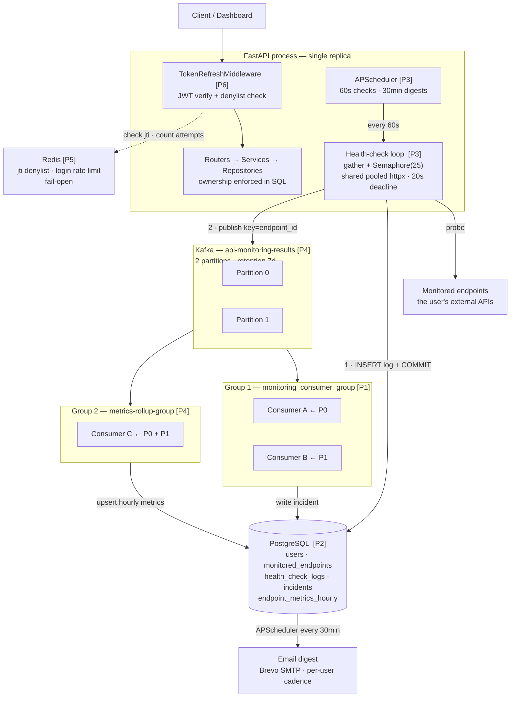

# Internal API Monitoring System — Architecture Review & Improvement Plan

## Context

You asked for an end-to-end review of this repository before any code changes, plus a plan to move it from a working prototype toward a production-grade distributed monitoring system — specifically around **Redis, Kafka, background jobs, health checks, reliability, and scalability** — without rewriting the code you have already built.

I read the codebase and independently verified every significant claim below against the source. **The headline finding changes the shape of this work:**

> Your Kafka consumer pipeline and your email alert job are not "basic" — they are **completely non-functional**. Neither has ever produced a result. Incidents are never created, and no digest email has ever been sent. Both fail silently, caught by broad `except` blocks that log and continue.

This matters because it inverts the priority order. There is no point tuning partition counts or adding Redis caching on top of a pipeline that produces nothing. **Phase 1 is making the system actually do what the architecture diagram says it does.** Everything else follows.

**Constraints confirmed with you (these shape every recommendation):**

| Constraint | Value | Consequence for this plan |
|---|---|---|
| Scale target | 100–500 endpoints @ 60s | No sharding, no worker fleet, no time-series DB |
| Deployment | Local/dev docker compose | No cloud infra, no Kubernetes, no multi-node Kafka |
| Scheduler | Stays in FastAPI, single replica | No separate scheduler container, no Celery/Arq |
| Scope | Top-3 highest-impact areas + analysis first | Focused plan, not a 40-item backlog |

---

## 1. Current Architecture

### Components

| Process | Entry point | Responsibility |
|---|---|---|
| `monitoring_api` | [app/main.py](app/main.py) | REST API + **both** APScheduler jobs (health checks every 60s, alert digests every 30 min) |
| `alert_consumer` | [app/services/healthConsumer.py](app/services/healthConsumer.py) | Kafka consumer → incident detection |
| `postgres` / `kafka` / `redis` | docker-compose | Storage, event bus, unused cache |

### Layering

`routers → services → repositories → SQLModel/SQLAlchemy async → Postgres`

This is clean and consistently applied. Sessions are injected via `Depends(get_db_session)` and threaded down; **no repository ever opens its own session** ([app/repositories/service_repository.py:8-10](app/repositories/service_repository.py#L8-L10)). That is the right design.

### Request flow (user-facing)

1. `TokenRefreshMiddleware` validates the JWT signature **and** expiry, sets `request.state.user`, calls through.
2. Router depends on `get_current_user_uid`, which **decodes the token a second time**.
3. Service constructs `ApiServiceRepository(user_uid, session)`.
4. Repository builds SQL with `owner_user_id` in the predicate.

### Health-check flow (every 60s)

```
APScheduler → Producer.run_all_health_checks()
  → get_all_api() → get_all_services()        [ALL rows, no is_active filter, no LIMIT]
  → for each endpoint SEQUENTIALLY:
      → check_api_health()                     [new httpx.AsyncClient per probe, ~15s worst case]
      → producer_client.send_result()          [send_and_wait, acks=all, blocks the loop]
      → new DB session → INSERT health_check_logs + COMMIT
```

### Kafka flow

```
Producer → topic "api-monitoring-results" (key = endpoint UUID, gzip, acks=all, idempotent)
  → 1 partition (broker default, auto-created)
  → KafkaConsumerClient (group "monitoring_consumer_group", auto-commit, earliest)
  → HealthConsumer.process_message() → [DEAD — see §4]
```

### Alert flow (every 30 min)

```
APScheduler → send_user_incident_alerts() → AttributeError on line 14 → [DEAD — see §4]
```

---

## 2. Architecture Rating

| Dimension | Rating | Justification |
|---|---|---|
| **Code quality** | 6.5 / 10 | Clean layering, explicit column lists, no bare `except`, consistent response envelope. Undermined by dict-vs-object confusion and dead imports. |
| **Architecture (design intent)** | 7.5 / 10 | The intended design is genuinely sound — CQRS-ish split of probing from analysis, event bus between them, repository pattern. This is a good design. |
| **Architecture (as implemented)** | 3 / 10 | Two of the four subsystems don't run. The event bus carries messages nobody successfully processes. |
| **Scalability** | 3 / 10 | Sequential probe loop, zero indexes on the hot tables, 1 Kafka partition, new HTTP client per probe. |
| **Reliability** | 2.5 / 10 | At-most-once Kafka, poison message kills the consumer, no producer reconnect, failures swallowed everywhere. |
| **Maintainability** | 6 / 10 | Easy to navigate and read. Hurt by silent failure paths that make bugs invisible. |
| **Production readiness** | 2 / 10 | Hardcoded `SECRET_KEY` default, expired tokens accepted at the dependency layer, exception strings returned to clients, no metrics. |
| **Overall** | **4 / 10** | A well-structured prototype whose async/event-driven half has never executed successfully. |

**The gap between "design intent 7.5" and "as implemented 3" is the entire story of this codebase.** You designed the right system. The wiring between the pieces was never verified end-to-end, and broad exception handling hid that fact.

---

## 3. What Is Already Good — Do Not Change

You asked me to verify your belief about the repository/query layer and auth before suggesting changes. Here is the honest verdict.

### The repository layer — you were largely right

**Keep exactly as-is:**

- **The LATERAL join in `get_services()`** ([service_repository.py:12-51](app/repositories/service_repository.py#L12-L51)). This is the textbook-correct idiom for latest-row-per-group and avoids the naive N+1 of one query per endpoint. Genuinely well done. *(Its performance problem is a missing index, not the query.)*
- **`UPDATE ... WHERE id = ? AND owner_user_id = ? RETURNING id`** ([:115-163](app/repositories/service_repository.py#L115-L163)). Race-free authorized writes in a single statement — no read-then-write TOCTOU. This is better than what most production codebases do.
- **Ownership enforced in SQL, not Python, on 100% of reachable endpoints.** I checked all seven service routes. **There is no reachable IDOR.**
- **Session injection via DI**, `expire_on_commit=False`, `pool_pre_ping=True`, explicit column lists instead of `SELECT *`, the UUID pre-validation guard in `get_logs`.

### Authentication — partly right

**Keep:** bcrypt via passlib with the correct compatible pinning (`passlib==1.7.4` + `bcrypt==4.0.1`), explicit `algorithms=[...]` on decode (no `alg:none` confusion), refresh token stored server-side so logout can revoke it, `.env` correctly gitignored.

**But auth is not fully correct** — see §4. Three real security defects.

### Infrastructure choices

Kafka keyed by endpoint UUID (preserves per-endpoint ordering), `enable_idempotence=True`, `acks=all`, per-endpoint `try/except` in the probe loop so one bad endpoint doesn't kill the cycle, alembic migrations with cascade deletes.

---

## 4. Problems — Verified, Ranked by Impact

### Tier 0 — Subsystems that do not run at all

| # | Location | Defect |
|---|---|---|
| 1 | [service_repository.py:253](app/repositories/service_repository.py#L253), [:270](app/repositories/service_repository.py#L270) | `get_consumer_service` / `get_last_three_records` filter `owner_user_id == self.user_uid`, but the consumer builds `ApiServiceRepository(session=session)` so `user_uid` is `None`. SQLAlchemy renders this as `owner_user_id IS NULL` against a `NOT NULL` column → **always returns nothing**. The consumer logs "No API details found" and returns. **No incident has ever been created.** |
| 2 | [alert_scheduler.py:14](app/services/alert_scheduler.py#L14) | `async with db.get_session()` — `DB` has no such method; only `init_db`, `close_db`, `get_db_session` exist. **`AttributeError` every 30 minutes. No digest email has ever been sent.** |
| 3 | [healthConsumer.py:44](app/services/healthConsumer.py#L44) | `api_details.expected_status_code` — attribute access on a **dict** returned by `dict(row)`. Would `AttributeError` even if #1 were fixed. |
| 4 | [services/service.py:164](app/services/service.py#L164) | `last_incident.end_time` — same dict-vs-object bug. **Incident merging always falls into the rollback branch.** |
| 5 | [alert_scheduler.py:47,103](app/services/alert_scheduler.py#L47) | `update_last_checked(session, api_id, now)` — 3 args, signature takes 2 → `TypeError`. The watermark would never advance → the same incidents re-emailed forever. |
| 6 | [service_repository.py:351](app/repositories/service_repository.py#L351) | `func.now()` — `func` is imported only *inside* `update_service` at line 116, never at module scope → `NameError`. |

**Why these stayed invisible:** every one is swallowed by a broad `except Exception` that logs and continues. The system reports itself healthy while doing nothing.

### Tier 1 — Scale and reliability

| # | Location | Defect | Impact |
|---|---|---|---|
| 7 | Migrations | **Only `ix_users_email` exists.** No index on `health_check_logs(endpoint_id, checked_at)`, `incidents(endpoint_id, start_time)`, or `monitored_endpoints(owner_user_id)`. Postgres does **not** auto-index FKs. | Every dashboard read and every consumer query is a seq scan + sort over the fastest-growing table (1440 rows/endpoint/day). Degrades quadratically. |
| 8 | [monitoring.py:49](app/services/monitoring.py#L49) | Sequential `for` loop. No `gather`/`TaskGroup`/`Semaphore` anywhere in the repo. Docstring and architecture.md both claim "concurrently" — **factually wrong**. | At ~15s worst case per endpoint, 500 endpoints cannot finish in 60s. |
| 9 | [main.py:36-41](app/main.py#L36-L41) | No `max_instances`/`coalesce`/`misfire_grace_time`. Defaults: `max_instances=1`, `misfire_grace_time=1s`. | Once a cycle exceeds 60s, subsequent fires are **silently skipped**. The effective interval becomes "however long one serial pass takes". |
| 10 | [api_client.py:39](app/infrastructure/clients/api_client.py#L39) | New `httpx.AsyncClient` per probe. | Full TCP+TLS handshake per endpoint per minute. No pooling, no keep-alive. |
| 11 | [consumer.py:28](app/infrastructure/kafka/consumer.py#L28) | `enable_auto_commit=True` with **no `commit()` call anywhere**. | At-most-once. A message can be marked consumed then lost when processing throws. |
| 12 | [healthConsumer.py:29](app/services/healthConsumer.py#L29) | `str(msg["id"])` is **outside** the try block. | A malformed message **kills the consumer process**. No DLQ. |
| 13 | [consumer.py:45-59](app/infrastructure/kafka/consumer.py#L45-L59) | On any Kafka error the generator logs, closes, and **terminates** → process exits 0 → relies on `restart: always`. | No reconnect, no backoff cap. |
| 14 | docker-compose | Topic auto-created with broker default **1 partition**. | Consumer scaling is capped at exactly one active consumer regardless of replicas. |
| 15 | [main.py:27-33](app/main.py#L27-L33) | Kafka connect failure swallowed at boot, **no reconnect path**. | `send_result` returns `False` forever after a boot-time outage. |
| 16 | [monitoring.py:62](app/services/monitoring.py#L62) vs [:77](app/services/monitoring.py#L77) | Kafka publish happens **before** the log row is inserted. | Consumer can read a stale last-3 window — a race baked into the design. |
| 17 | [monitoring.py:44-47](app/services/monitoring.py#L44-L47) | Pydantic coercion is **outside** the try. | One malformed DB row aborts the entire cycle for all endpoints. |
| 18 | [api_client.py:53-57](app/infrastructure/clients/api_client.py#L53-L57) | "Truncation" stores the **full** body under `preview`. | Multi-MB rows in `health_check_logs`, 1440×/day/endpoint. Unbounded table bloat. |
| 19 | [service_repository.py:210](app/repositories/service_repository.py#L210) | `get_all_services()` ignores `is_active` and has no `LIMIT`. | Deactivated endpoints are still probed every minute. |

### Tier 2 — Security

| # | Location | Defect |
|---|---|---|
| 20 | [services/auth.py:58-73](app/services/auth.py#L58-L73) | **`validate_refresh_token` never compares the presented token to the stored one.** It extracts `user_uid` and then validates the *database's* copy. Any validly-signed token for that user — including a plain **access token** — mints a fresh access token. Plus `verify_exp: False` and no `refresh` claim check. |
| 21 | [security.py:120](app/core/security.py#L120) | `get_current_user_uid` decodes with `options={"verify_exp": False}` — **expired tokens authenticate**. Currently masked only by the middleware; any path added to the middleware skip-list becomes exploitable. |
| 22 | [config.py:32](app/core/config.py#L32) | `SECRET_KEY: str = "change-this-secret"` — a hardcoded default. Missing `.env` → the app boots and signs tokens with a publicly known key. |
| 23 | routers/*.py | Internal exception strings returned to clients (`f"Error fetching services: {str(e)}"`). Leaks table/column names. |
| 24 | [routers/service.py:91-98](app/routers/service.py#L91-L98) | Returns **200 + `success: true` + `data: null`** for a nonexistent or non-owned service. Should be 404. |
| 25 | [config.py:34](app/core/config.py#L34) | `REFRESH_TOKEN_EXPIRY: int = 1  # in days` but the code passes it to `timedelta(seconds=...)`. The default means refresh tokens expire in **1 second**; only the `.env` value papers over it. |

### Tier 3 — Redis

**Redis is entirely dead weight.** `redis.from_url` is called in `init_db` but is **lazy** — no socket is ever opened. There is no `.get`/`.set`/`.expire` call anywhere in `app/`. `redis/client.py` is 100% commented out; `redis/cache.py` is 0 bytes.

---

## 4b. Log File Committed to Git — Hygiene Fix

`logs/app.log.1` (5.2 MB) is **tracked in git** and present in at least two commits (`3f0dfdf`, `3227180`). It contains 14 JWT-shaped strings logged as `authorization: Bearer <token>` request headers, plus email addresses, internal hostnames, and response bodies.

**You confirmed these values are test data**, so no credential rotation or history rewriting is needed. What remains is worth fixing anyway, because the *mechanism* that put them there is still live and will capture real tokens the moment a user registers an endpoint with genuine credentials:

1. `.gitignore` line 13 is `*.log`, which does **not** match rotated files named `app.log.1`. Add `*.log.*` and `logs/`.
2. `git rm --cached logs/app.log.1` — it also bloats every clone by 5 MB and ships into the Docker build context.
3. **Redact `authorization` / `cookie` / `api-key` header values before logging.** This is the real fix. Right now `request_headers` is logged verbatim at INFO, so any real credential a user registers lands in the log file, in the container's stdout, and — via CI's `Dump Logs on Failure` step — in your GitHub Actions output, where secret masking will not catch it.

Handled in Phase 0 and Phase 7 below.

---

## 4c. Infrastructure & Operations Findings

| Area | Finding |
|---|---|
| **Kafka topology** | Single-node KRaft, **no volume mounted** → all topic data and metadata lost on container removal. Topic auto-created with **1 partition** → consumer scaling capped at exactly one instance forever. |
| **Scaling** | Neither container can be scaled: `container_name:` is set on every service (Compose refuses `--scale`), and `fastapi` binds a fixed host port. Correctness-wise, N API replicas would mean N× duplicate probes, N× Kafka messages, N× log rows — which **corrupts incident detection**, since "last 3 records" would become 3 copies of one instant, promoting a single blip to an incident. |
| **Dockerfiles** | Both run as **root**, single-stage, no `HEALTHCHECK`, no `.dockerignore` (so `.git`, `venv/`, and the 5 MB log ship in the build context). **`--reload` is enabled in the AWS/production image.** `gcc` + `librdkafka-dev` are installed for `confluent-kafka`, which isn't a dependency — pure bloat. |
| **Health endpoint** | `GET /api/services/health` returns a hard-coded 200 and **checks nothing** — not Postgres, not Kafka, not the scheduler. It returns healthy while the Kafka producer is dead. No `/readyz`. No Docker or Compose healthcheck on `fastapi` or `consumer`. |
| **Observability** | No metrics, no tracing, no error tracker — zero hits for prometheus/otel/sentry/statsd. Logging is unstructured text with **three competing configurations** (`loggers.py`, `basicConfig` in four modules, `alembic.ini`). |
| **Log file** | Both containers bind-mount the repo and write/rotate the **same** `logs/app.log` through `RotatingFileHandler`, which is **not multi-process safe** → interleaved and lost records. |
| **Dead config** | 7 of 36 settings are never read: `KAFKA_BROKER` (yet this is what `.env` and CI actually set — the code reads `KAFKA_BROKER_URL`), `NOTIFY_EMAIL`, `NOTIFY_WEBHOOK`, `SMTP_SERVER`, `Port`, `Login`, `Password`. |
| **Dead deps** | `loguru`, `databases` are installed and never imported. `win32_setctime` (Windows-only) ships into a Linux image. `pytest` is **missing** from requirements despite tests importing it. |
| **Alembic** | `env.py` builds the DB URL from `os.getenv` directly rather than from `Config` — a **second, divergent source of DB configuration**. `compare_type`/`compare_server_default` are off, so autogenerate silently misses type and default drift. |
| **Compose duplication** | `docker-compose-aws.yml` is a byte-for-byte copy of `docker-compose.yml` except one line. Every change must be made twice. |
| **Exposed ports** | Postgres, Redis, and Kafka all publish to the host in **both** files. Redis has no `requirepass`; Kafka is PLAINTEXT with no auth. |
| **Tests** | Zero coverage of Kafka, incident detection, the scheduler, `check_api_health`, email, or any dependency-failure path. `test_SERVICE_010` contains a hard-coded **`time.sleep(65)`**. No teardown — every CI run permanently accretes rows. Tests depend on the public internet (`dummyjson.com`). |

---

## 5. Proposed Architecture

The architecture **does not change shape**. Your design was right; the wiring wasn't. What changes is inside the boxes:

> **Rendered version:** [docs/architecture-diagram.html](docs/architecture-diagram.html) — open in a browser for the full annotated diagram. `[P1]`–`[P6]` below mark which phase touches each component.



**Three rules the diagram encodes:**

1. **DB write before publish.** A failed publish then delays detection by one cycle instead of producing a wrong verdict. The current order does the opposite.
2. **Both groups read every message**, with independent offsets — the rollup falling behind cannot affect alerting. That isolation is the entire justification for a second group rather than a second function call.
3. **Within a group, partitions divide.** Two consumers take one partition each; a third would idle. Keying by `endpoint_id` pins each endpoint to one partition, which is what makes two detectors safe on the "last 3 checks" window.

Postgres stays the source of truth. Redis is a **read-through accelerator that is always optional** — every Redis path has a Postgres fallback, so pulling the Redis container out degrades performance and nothing else.

---

## 6. Improvement Plan (Phased)

### Phase 0 — Repo hygiene (30 min, no runtime risk)

You confirmed the logged tokens are test data, so this is cleanup rather than incident response:

- `.gitignore`: add `*.log.*` and `logs/` — the current `*.log` pattern does not match rotated `app.log.1`.
- `git rm --cached logs/app.log.1` and commit.
- Redact `authorization` / `cookie` / `api-key` header values before logging them (see Phase 5).

### Phase 1 — Revive the dead pipeline ★ MUST HAVE

> **Sequencing note:** apply the Phase 2 indexes *before or together with* this phase. Right now the consumer bails instantly because `get_consumer_service` returns `None`, so it issues almost no DB work. The moment you fix it, **two queries per message fire against an unindexed `health_check_logs`** — roughly 1000 queries/minute at 500 endpoints, against a table growing 720k rows/day. Fixing the pipeline without the indexes turns a dead subsystem into a slow one.

Nothing else in this plan produces value until these six defects are fixed. All are small, surgical edits.

| Fix | File | Change |
|---|---|---|
| 1 | [service_repository.py:244-274](app/repositories/service_repository.py#L244) | **Drop the `owner_user_id` predicate** from `get_consumer_service` and `get_last_three_records`. These two are called *only* from the consumer, which legitimately runs as a system context — the `endpoint_id` originates from our own producer, not from user input, so there is no IDOR risk. Add a comment saying so. *(I verified no router path reaches either method.)* |
| 2 | [healthConsumer.py:44-45,54,70,85](app/services/healthConsumer.py#L44) | Change attribute access to subscript: `api_details["expected_status_code"]`. The repository returns `dict(row)`. |
| 3 | [services/service.py:164-169](app/services/service.py#L164) | Same fix: `last_incident["end_time"]`, `["initial_error"]`, `["id"]`. |
| 4 | [alert_scheduler.py:14](app/services/alert_scheduler.py#L14) | `db.get_session()` → `db.pg_session_factory()`, matching the pattern already used in [monitoring.py:21](app/services/monitoring.py#L21). Reuses existing code, no new helper. |
| 5 | [service_repository.py:3](app/repositories/service_repository.py#L3) | Add `func` to the module-scope import. Delete the function-local import at line 116. |
| 6 | [services/service.py:200](app/services/service.py#L200) + [alert_scheduler.py:47,103](app/services/alert_scheduler.py#L47) | Reconcile the arity — give `update_last_checked` an optional `checked_at` param, or drop the third argument at both call sites. |

**Also in this phase:**

- Move `endpoint_id = str(msg["id"])` ([healthConsumer.py:29](app/services/healthConsumer.py#L29)) *inside* the try block, so a malformed message can no longer kill the process.
- Replace `HealthConsumer.get_db_session` ([healthConsumer.py:13-23](app/services/healthConsumer.py#L13-L23)) with `async with db.pg_session_factory() as session:`. That helper **returns an already-closed session** — `aclose()` in the `finally` throws `GeneratorExit` at the yield, unwinding the `async with` and closing the session *before* the return completes. It only works because SQLAlchemy 2.0 soft-closes and re-begins on next use. Use the pattern already at [monitoring.py:21](app/services/monitoring.py#L21).

**Verification gate:** register an endpoint pointing at a URL that returns 500, wait 3 cycles, and confirm a row appears in `incidents`. That has never happened in this codebase.

### Phase 2 — Indexes ★ MUST HAVE (do before Redis)

One new alembic migration:

```sql
CREATE INDEX ix_hcl_endpoint_checked  ON health_check_logs (endpoint_id, checked_at DESC);
CREATE INDEX ix_incidents_endpoint_start ON incidents (endpoint_id, start_time DESC);
CREATE INDEX ix_monitored_endpoints_owner ON monitored_endpoints (owner_user_id);
```

**Sequencing matters:** these three indexes will make your dashboard queries fast on their own. Adding Redis caching first would mask the missing index rather than fix it, and you'd be maintaining a cache to paper over a one-line migration. Measure after this phase before deciding how much Redis you actually need.

Also here: change `get_all_services()` to filter `is_active == True`, or switch the caller to the already-correct `get_all_api_services()` ([service_repository.py:314](app/repositories/service_repository.py#L314)).

### Phase 3 — Health-check concurrency & failure isolation ★ MUST HAVE

All in [monitoring.py](app/services/monitoring.py) and [api_client.py](app/infrastructure/clients/api_client.py):

**⚠️ Prerequisite — raise the DB pool first, in the same phase, *before* enabling concurrency.** [connect.py:30](app/utils/connect.py#L30) uses SQLAlchemy defaults: `pool_size=5, max_overflow=10` = **15 connections**. Putting 50 coroutines in flight, each opening a session for its log insert, fails as `QueuePool limit of size 5 overflow 10 reached` — and because that raises *inside* the per-endpoint try, you'd see scattered per-endpoint errors rather than an obvious pool problem. Set `pool_size=20, max_overflow=10, pool_timeout=30`.

1. **Concurrency:** replace the `for` loop with `asyncio.gather(*[_check_one(s) for s in services], return_exceptions=True)`, where `_check_one` holds an `asyncio.Semaphore` sized from a new `Config.HEALTH_CHECK_CONCURRENCY` (default 50; 25 if the monitored services are sensitive to bursts). `return_exceptions=True` plus the existing per-endpoint `try/except` gives **two layers of failure isolation**.
   **Not `asyncio.TaskGroup`** — despite being available on 3.12, it is **fail-fast**: the first task to raise cancels every sibling. For a health-check fan-out that is exactly backwards, and the cancellation would land mid-DB-write. `gather(return_exceptions=True)` gives isolation *structurally* rather than by convention.
2. **Shared HTTP client:** module-level singleton in `api_client.py`, initialized/closed from the `main.py` lifespan, reached through a **lazy getter** that creates it if absent. The lazy part matters: the consumer process never imports `api_client` today, and lazy construction guarantees no socket pool is ever created unless `check_api_health` is actually called — so the import graph changing later can't surprise you. Don't wrap the shared client in `async with`; that would close the pool after the first probe.
   Limits: `max_connections=100` (must exceed the semaphore, or httpx becomes the real limiter), `max_keepalive_connections=50`, and **`keepalive_expiry=15.0`**.
   **The keepalive value is the non-obvious one.** Do *not* raise it to 60+ to "reuse connections across cycles". A pooled socket the server has already closed raises `RemoteProtocolError` on reuse, and **httpx does not transparently retry it** — which on a monitoring tool means a **false unhealthy reading**, i.e. fabricated incidents. Typical server idle timeouts are 60–75s, so 15s guarantees recycling well before that while still getting the within-cycle reuse that actually matters.
3. **Hard per-check deadline:** wrap each probe in `asyncio.wait_for(..., timeout=20)` as a backstop above httpx's own timeouts.
4. **`httpx.PoolTimeout` must not be recorded as an endpoint failure.** It subclasses `httpx.TimeoutException`, so the handler at [api_client.py:67](app/infrastructure/clients/api_client.py#L67) would log monitor-side pool saturation as `"Request timed out"` — and three in a row fabricates an incident for a perfectly healthy service. Add `except httpx.PoolTimeout` **before** the `TimeoutException` handler (subclass first) with a distinct message.
4. **APScheduler kwargs** ([main.py:36-41](app/main.py#L36-L41)): `coalesce=True`, `misfire_grace_time=30`, keep `max_instances=1`. Today's `misfire_grace_time=1` silently discards any fire that is 2 seconds late.
5. **Move the Pydantic coercion inside the try** ([monitoring.py:44-47](app/services/monitoring.py#L44)) so one malformed row skips one endpoint instead of aborting the cycle.
6. **Reorder:** DB insert *before* Kafka publish, removing the stale-window race at the source. Cheaper and more honest than compensating for it in the consumer.
7. **Fix the truncation bug** ([api_client.py:53-57](app/infrastructure/clients/api_client.py#L53)) — store `json_str[:100_000]`, not the full object. This is what's about to bloat `health_check_logs`.
8. Delete the duplicated import block at [api_client.py:12-19](app/infrastructure/clients/api_client.py#L12).

### Phase 4 — Kafka: make it load-bearing, then make it reliable ★ SHOULD HAVE

> **Decided with you:** Kafka stays, and the goal is portfolio/system-design quality. That raises the bar — it has to be *correct* Kafka, not decorative Kafka.

**The diagnosis:** today the broker is a **trigger, not an event log**. The producer writes `health_check_logs` to Postgres, publishes `{id, status_code, response_time_ms}`, and the consumer immediately queries Postgres for everything it actually needs. The message carries no information the system didn't already have one line earlier — which is exactly why deleting it would cost nothing. Correct Kafka inverts that: the topic is the record of what happened, events are self-describing, and independent consumers project the stream into different views.

#### 4a. Self-describing events — biggest win per line changed

Add `expected_status_code`, `expected_latency_ms`, `name`, and `event_version` to `ProducerResultModal` ([schemas/service.py:107](app/schemas/service.py#L107)), and add `expected_latency_ms` to `ApiProducerServiceModal` — [get_all_services already selects it](app/repositories/service_repository.py#L222) and the schema simply drops it, so the producer has this in memory already.

This deletes an entire DB query per message, and more importantly makes the event mean something standalone: thresholds are evaluated **as-of-publish** rather than as-of-consume, so replaying the topic next week reproduces the same verdict even if the user has since edited the endpoint. That property is the point of an event log.

*Rollout compatibility:* during deploy the consumer must tolerate messages lacking the new fields and fall back to the DB lookup, or in-flight messages from the old producer break it.

#### 4b. A second topic — this is what makes Kafka load-bearing

```
health-check-results   (raw facts, ~8/s, 7-day retention)
        └─► incident-detector ──► incidents   (incident.opened / incident.resolved)
                                      ├─► notification consumer (email digests)
                                      ├─► webhook/Slack consumer (future)
                                      └─► SLA rollup consumer    (future)
```

The consumer stops being a dead end and becomes a **stream processor** — consumes facts, produces domain events. Two topics, multiple independent consumer groups: the thing Kafka is actually for.

This also supersedes the polling design for alerts. Rather than a 30-minute cron scanning `incidents` in Postgres, the notification service consumes `incident.opened`. The per-user digest cadence is a **notification policy**, so it stays — the consumer buffers per user and a timer flushes on their configured interval. Push-based instead of repeatedly scanning a table for things that changed.

Requires adding `send_raw(topic, key, value)` to `KafkaProducerClient` (~8 lines, reuses the class) and instantiating a producer inside the consumer container, which has none today.

#### 4b-2. Second consumer group: SLA / metrics rollup ★ decided with you

**Target topology — three groups, two topics, each justifiable in one sentence:**

```
health-check-results  (3 partitions, 7d retention, keyed by endpoint_id)
   ├─ group: incident-detector   (2 consumers, partitions divided)  ──► incidents topic
   └─ group: metrics-rollup      (1 consumer)                       ──► endpoint_metrics_hourly

incidents  (low volume, long retention)
   └─ group: notifications       (1 consumer)  ──► email digests, Slack later
```

**Two mechanisms, often conflated — keep them distinct:** the *consumer group* tracks offsets, so a dead consumer's partitions are reassigned and resume from the last commit. What keeps messages *available* to resume from is the *topic's retention* setting. Group = resumability; retention = the window you can resume within.

**Why 2 detector consumers is safe here:** the producer keys by `endpoint_id`, so every event for an endpoint always lands on the same partition and therefore the same consumer. The "last 3 checks" window can never be split across two instances racing each other. This falls out of the existing keying choice — no extra work. *(It does require ≥2 partitions; with 1 the second consumer idles forever.)*

**What the rollup builds** — new table `endpoint_metrics_hourly`:

| Column | Purpose |
|---|---|
| `endpoint_id`, `hour_bucket` | composite PK |
| `total_checks`, `healthy_checks` | exact uptime % |
| `sum_latency_ms`, `min_latency_ms`, `max_latency_ms` | exact average and range |
| `latency_buckets` (JSONB histogram: `<50, <100, <250, <500, <1000, <2500, <5000, +Inf`) | approximate p50/p95/p99 |

Powers "99.2% uptime (30d)", latency trend charts, and an SLA line in the digest email — none of which the product can answer today.

**Why this earns its own consumer group** (the load-bearing argument): at 500 endpoints you write **720k rows/day** to `health_check_logs`, so computing 30-day uptime on read means aggregating ~21M rows per dashboard load. Pre-aggregating on the write path is the correct answer, and a stream consumer is the natural place for it. It also lags gracefully — if the rollup falls behind, alerting is completely unaffected. That isolation is precisely what a separate group is for.

**Percentiles from a stream:** exact percentiles need every value retained, so use fixed histogram buckets (the Prometheus approach) — bounded storage, approximate p95/p99, exact uptime. State the approximation in the API response rather than implying precision you don't have.

**⚠️ The honest problem — counter increments are NOT idempotent under at-least-once.** A redelivered message double-counts. This is the one place where the delivery semantics chosen in 4d actually bite, and it's worth solving deliberately rather than ignoring:

- Duplicates are rare (only on crash mid-batch), and the drift on a *percentage* is negligible.
- Bound it anyway with a **reconciliation job**: a periodic recompute of the current and previous hour directly from `health_check_logs` (cheap with the Phase 2 index), which overwrites the streamed values. Streaming for freshness, batch for correctness.
- For a full rebuild: truncate the table, reset the group offset to earliest, replay.

That combination — a fast approximate streaming path plus a slower authoritative batch path — is a real production pattern, and being able to explain *why* it's needed here is worth more than the code itself.

#### 4c. Retention as a feature

Set 7-day retention on `health-check-results`. This buys a demonstrable capability: **rebuild every incident from scratch** by resetting the consumer group to earliest. The incidents table becomes a replayable projection rather than hand-maintained state, and a future change to the detection rule can be applied to history instead of only going forward. Best Kafka talking point in the project, cost of one topic config.

#### 4d. Reliability — table stakes, not architecture

| Change | Rationale |
|---|---|
| `enable_auto_commit=False` + explicit `commit()` after successful processing | Moves you from **at-most-once to at-least-once**. Safe here because incident detection recomputes from the last-3 DB rows — reprocessing the same message is already idempotent. |
| Outer `while True` reconnect loop around the `async for`, with capped exponential backoff; remove `finally: await self.close()` from the generator | Today any Kafka hiccup ends the generator, exits the process, and relies on `restart: always`. |
| **Delete `value_deserializer` from the consumer config** ([consumer.py:30](app/infrastructure/kafka/consumer.py#L30)) and do `json.loads(message.value)` inside `process_message`'s try | **The single most important Kafka fix.** A malformed payload currently raises *inside aiokafka's fetcher*, surfacing from the iterator itself — you cannot catch it and advance past it, so the same record is re-fetched forever. That is an **unbreakable poison loop no try/except in your handler can escape.** Parsing in your own code makes it an ordinary exception you can log, commit past, and continue. |
| Poison handling: log → commit → continue. **Skip the DLQ for now** | Every message on this topic is produced by your own Pydantic `model_dump_json()`, so data-shaped poison is nearly impossible; the realistic cases are a field rename deployed out of order, or a manual `kafka-console-producer` test. Five lines of skip-and-log gets you the property you actually want — the process survives — with no new topic, no producer instance inside the consumer container, and no topic nobody reads. |
| Producer: `stop()` the previous instance before recreating on retry; add `ensure_connected()` guarded by an **`asyncio.Lock`**, called from `send_result` | Fixes the object leak at [producer.py:49](app/infrastructure/kafka/producer.py#L49) and the permanent-dead-producer state after a boot-time outage. **The lock is essential once Phase 3 is concurrent** — without it, 50 coroutines hitting a `None` producer each launch a full 5-attempt retry loop simultaneously: a connect storm against a broker that is already down. Also null the producer on `KafkaConnectionError` in `send_result`, so a producer whose broker died later can recover. |
| `KAFKA_NUM_PARTITIONS: 3` in compose | **Not for throughput** — you'd need five orders of magnitude more traffic to need it. With two consumer groups (4b) and a detector doing DB work per message, 3 partitions gives head-of-line-blocking headroom and lets you actually run a second detector instance. Keying by `endpoint_id` preserves per-endpoint ordering at any partition count. *Note `KAFKA_NUM_PARTITIONS` only affects newly-created topics — the existing one stays at 1 until altered or deleted.* |
| Add a named volume for Kafka | Currently all topic data and KRaft metadata vanish when the container is removed. |

**Keep `send_and_wait`.** Once probes run concurrently the waits overlap completely and aiokafka's accumulator batches them into the same produce request anyway — you get the batching benefit *for free* from the concurrency fix. Fire-and-forget would trade synchronous error visibility for throughput you don't need at 8 msg/s, and it adds a footgun: `send()` returns a Future, so shutdown would need an explicit `flush()` in `close()` or buffered messages are silently dropped.

**🔴 One-time operational step before deploying this phase.** `auto_offset_reset="earliest"` combined with a consumer that *starts working for the first time* means it will **replay the entire retained topic backlog** — and every replayed message gets evaluated against the *current* last-3-records window, manufacturing bogus historical incidents. Before rollout, either reset the group offset or drop the topic:

```bash
kafka-consumer-groups --bootstrap-server kafka:29092 --group monitoring_consumer_group \
  --topic api-monitoring-results --reset-offsets --to-latest --execute
```

This is easy to miss and will look like the fix broke something.

*(Aside worth knowing: `ConsumerStoppedError` inherits from `Exception`, **not** `KafkaError` — so the `except KafkaError` at [consumer.py:54](app/infrastructure/kafka/consumer.py#L54) never catches it and it falls through to the generic handler, which terminates the generator anyway.)*

#### Deliberately NOT built — name these in your README as considered-and-rejected

For a portfolio project, articulating why you *didn't* reach for something reads better than having built it:

| Rejected | Why |
|---|---|
| **Schema Registry** (Avro/Protobuf) | One producer, one consumer, same repo, same Pydantic class — your schema contract is a Python import, which is *stronger* than a registry. Tolerant parsing plus `event_version` is the compatibility strategy. |
| **Kafka Streams / ksqlDB** | A JVM runtime to do what ~40 lines of Python already does at 8 msg/s. |
| **Exactly-once / transactions** | EOS is end-to-end *within Kafka*; your side effect is a Postgres write, so you'd still need an idempotent handler — and you already have one. At-least-once + idempotent reaches the identical outcome with none of the machinery. |
| **Transactional outbox** | Solves the commit-then-publish gap, which here self-heals within one 60s cycle. A table plus a relay process to avoid a one-cycle detection delay. |
| **Per-endpoint adaptive backoff / circuit breakers** | Actively wrong for a monitor — it is *supposed* to keep probing a down endpoint. Backing off delays *recovery* detection, the opposite of the product's job. |

#### Stretch (later, not now): stateful stream processing

Because events are keyed by `endpoint_id`, every event for an endpoint lands on one partition and therefore one consumer instance. That means the detector could legitimately hold the last-3 window **in memory** rather than querying Postgres, rebuilding state from the topic on partition assignment. This is textbook stateful stream processing and the most advanced idea in the design — it is also the riskiest (state loss on rebalance, warm-up gaps). Keep reading from Postgres initially; treat this as an upgrade once the rest is stable.

### Phase 5 — Redis, where it actually earns its place ★ SHOULD HAVE

> **Revised after design review.** My first draft recommended caching the latest status and moving the last-3 incident-detection window into Redis. A deeper design pass argued against both, and the counter-argument is stronger than my original reasoning. The Redis scope below is deliberately *smaller* than what I first proposed. This is the section that most directly honors your "don't add Redis for the sake of using Redis" instruction.

**Recommended — only these two features, plus client hardening:**

| Use case | Key | Structure / TTL | Why it earns its place |
|---|---|---|---|
| **Login rate limiting** | `rl:login:ip:{ip}` (10 / 5 min)<br>`rl:login:email:{email}` (5 / 15 min) | `INCR` + `EXPIRE ... NX`, one pipelined round trip | Not merely security hygiene — an **availability fix**. See the bcrypt finding below. `/login` has no gate of any kind today. A plain counter, not a ZSET: a sorted set stores one member per attempt, so memory grows with attack volume — backwards for a DoS defense. |
| **JWT `jti` denylist** | `auth:jti:denied:{jti}` | String `"1"`, TTL = the token's own remaining life (`exp - now`) | You already mint a `jti` and throw it away, so logout leaves the access token valid for up to an hour. Redis is genuinely the right tool: per-key TTL means no cleanup job. A Postgres denylist would cost a round trip on *every* request plus a reaper. |

Both read paths are already-existing choke points, so the diff stays tiny: the denylist check goes in `TokenRefreshMiddleware` right after `decode_token` (zero router changes), and the rate-limit check goes at the top of `login_user`, **before** bcrypt and before the DB lookup — so a blocked request costs nothing.

**Explicitly rejected — and this now includes two I originally recommended:**

- **~~Last-3 sliding window in Redis~~** — *reversed.* It looks like the canonical Redis shape, but it would create a **second source of truth for incident creation**: a Redis restart empties the windows, so incidents get missed or delayed three cycles, and "what the dashboard shows" can permanently diverge from "what fired the alert". The two bugs it appeared to fix are already fixed elsewhere in this plan as two-line Postgres changes — reorder insert-before-publish (Phase 3) and drop the `owner_user_id` filter (Phase 1). With the Phase 2 index, that query is ~1 ms. Not worth a second source of truth for your alerting.
- **~~Latest-status cache~~** — *reversed.* Any TTL means the dashboard can show **"healthy" for an endpoint that went down a full cycle ago**. On a monitoring product that is a regression in the core value proposition, traded for a few milliseconds against a correctly-indexed query. Write-through removes the staleness but hands you a dual-write consistency problem for no measurable gain at a handful of polls per second.
- **Full response caching of dashboard reads** — a band-aid for the missing index. Fix the index instead.
- **Scheduler leader lock** — you have one replica and one uvicorn worker. This solves a problem you do not have. When you do scale, lift the scheduler into its own container (you already have the `consumer` pattern for exactly this) rather than bolting a lock onto a shared process.
- **Kafka dedup keys** — `createOrUpdateIncident` already merges into the last incident rather than inserting a duplicate, so a replayed message costs one redundant UPDATE. The correct fix for exactly-once side effects is a UNIQUE constraint, not a Redis key that can expire out from under you.
- **Uptime counters** — the feature doesn't exist yet; building for it is speculative. When it does, the right answer is a Postgres daily rollup table you can audit and backfill, not `INCRBY` values you can never reconstruct.

**The consistency story is that there isn't one.** Nothing in the health-check path writes to Redis, and nothing in the read path consults it. That is the point, and it's why this scope has no dual-write problem to reason about. The invariant:

> Postgres is the source of truth. Redis holds only ephemeral security state that is not reconstructable from Postgres and whose total loss is acceptable.

`FLUSHALL` on this Redis resets some rate-limit windows and un-revokes some already-logged-out tokens for the remainder of their ≤1 h life. **Not one byte of monitoring data is lost.** That is the bar a "no consistency problems" Redis integration should clear.

**⚠️ The real blocker for "Redis is optional" — fix this first.** [connect.py:22](app/utils/connect.py#L22) calls `from_url` with **no `socket_timeout` and no `socket_connect_timeout`**, and both default to `None` = infinite. Connection-*refused* fails fast, but a **hung** Redis (paused container, dropped packet) would block every awaiting request forever. Until this is set, "optional" is a claim the code cannot honor. Add `socket_timeout=0.25, socket_connect_timeout=0.25, retry_on_timeout=False`.

Two smaller fixes in the same file: percent-encode the password (a `/`, `?`, or `#` in `REDIS_PASSWORD` silently mis-parses the URL), and switch the deprecated `close()` to `aclose()`.

*(Resolved: the `redis://:@host:6379` form with empty credentials is **fine** — redis-py's `parse_url` uses truthiness checks, so no AUTH is sent. This was flagged as unverified in my first draft; it checks out.)*

**Placement:** `redis/client.py` gets plumbing only — `get_redis()`, a `redis_call(fn, *args, default=None)` wrapper that returns the default on `RedisError`/`TimeoutError`/`OSError`/client-is-None, and a module-level "degraded" flag so an outage logs once on transition rather than once per request. `redis/cache.py` gets the feature helpers and key constants, with a docstring stating plainly that it is not a cache. Reuse `db.redis_client`; do not create a second pool. No Redis repository class, no cache interface, no decorators.

**Failure policy is fail-open, deliberately:** if Redis is down, rate limiting allows and the denylist check passes. A monitoring dashboard going dark because a cache is unavailable is worse than a logged-out token working for under an hour. Fail-*closed* would be right for a system holding money or PII; this one holds endpoint URLs.

### Phase 6 — Auth security ★ SHOULD HAVE

Per your instruction, after the pipeline work:

1. **`validate_refresh_token`** ([services/auth.py:58-73](app/services/auth.py#L58-L73)) — compare the presented token against the stored one, set `verify_exp: True`, and assert the `refresh` claim is true. Currently a plain access token mints a new access token. Add rotation on use.
2. **`get_current_user_uid`** ([security.py:120](app/core/security.py#L120)) — remove `verify_exp: False`; parse the header safely so a missing/malformed header returns **401, not 500**.
3. **`SECRET_KEY`** ([config.py:32](app/core/config.py#L32)) — drop the default and fail fast at startup if unset.
4. **`REFRESH_TOKEN_EXPIRY`** ([config.py:34](app/core/config.py#L34)) — the comment says days, the code passes seconds. Fix one or the other; the default currently means 1 second.
5. **Generic client errors** — log `str(e)`, return a fixed message. Stop leaking SQLAlchemy internals.
6. **Return 404**, not `200 + data: null`, for missing/non-owned services ([routers/service.py:91-98](app/routers/service.py#L91-L98)).
7. **🔴 Move bcrypt off the event loop.** `verify_password` is a **synchronous** function ([security.py:23](app/core/security.py#L23)) calling `pwd_context.verify` — roughly **250 ms of CPU** — invoked directly inside the `async def` login endpoint at [auth.py:65](app/routers/auth.py#L65). There is no `run_in_threadpool` or `to_thread` anywhere in the codebase. Every login attempt therefore **blocks the entire event loop**, including the APScheduler job running health checks on that same loop: roughly 4 attempts/second starves your monitoring completely. Wrap both `verify_password` and `generate_password_hash` in Starlette's `run_in_threadpool`. This is the root cause; the Phase 5 login rate limiter is the perimeter. Do both.

### Phase 7 — Observability ★ NICE TO HAVE

- Make `/api/services/health` actually check Postgres, Redis, and the Kafka producer; add `/readyz`.
- Log to stdout only in containers (drop the shared bind-mounted rotating file — it is not multi-process safe and both containers write to it).
- Redact sensitive headers before logging.
- Consolidate the three competing logging configs onto `loggers.py`.

---

## 7. Implementation Strategy

Each phase is independently shippable and leaves the system working:

| Phase | Effort | Ship independently? | Gate before moving on |
|---|---|---|---|
| 0 — hygiene | 30 min | Yes | `git ls-files \| grep log` is clean |
| 1 — revive pipeline | 2–3 h | Yes | **An incident row actually appears** |
| 2 — indexes | 1 h | Yes | `EXPLAIN ANALYZE` shows Index Scan, not Seq Scan |
| 3 — concurrency | 3–4 h | Yes | 100 endpoints complete a cycle well under 60s |
| 4 — Kafka | 3–4 h | Yes | Kill the consumer mid-message; confirm reprocessing, not loss |
| 5 — Redis | 3–4 h | Yes | Stop the Redis container; everything still works, just slower |
| 6 — auth | 2–3 h | Yes | Expired token → 401; access token rejected at `/refresh` |
| 7 — observability | 2–3 h | Yes | `/readyz` returns 503 when Kafka is down |

Stopping after Phase 3 already gets you a system that works and scales to your target. Phases 4–7 are hardening.

---

## 8. Risk Assessment

| Change | Risk | Mitigation |
|---|---|---|
| Dropping `owner_user_id` from the two consumer queries | Would be a cross-tenant leak **if** either method were ever called from a user-facing route | I verified neither is router-reachable. Add a docstring marking them system-context-only, and keep the two user-facing latency methods untouched. |
| Concurrency in the probe loop | 25 simultaneous outbound requests could look like a burst to a shared upstream | Semaphore is tunable via config; start at 10 if the monitored services are sensitive. |
| Manual Kafka commits | A processing bug now causes reprocessing instead of silent loss | This is the intended trade. Incident logic is already idempotent (recomputed from DB state). |
| Changing partition count 1 → 3 | Existing endpoint→partition assignments reshuffle; briefly, two messages for one endpoint could be processed out of order | Do it during a quiet window, or recreate the topic. At 60s intervals the exposure is one cycle. |
| Removing `verify_exp: False` | Any client relying on expired tokens silently working will start getting 401s | This is the point. The middleware already enforces expiry, so well-behaved clients see no change. |
| Redis in the hot path | A Redis outage could break health checks if written carelessly | Non-negotiable rule: every Redis call is wrapped and returns `None` on failure. Test by stopping the container. |
| Index creation | Locks on a large table | Trivial at dev-scale data. Use `CREATE INDEX CONCURRENTLY` in a real deployment. |

---

## 9. Final Priority

**Must Have**
- Phase 1 — the six defects killing incident detection and alerts
- Phase 2 — the three indexes
- Phase 3 — concurrency, shared HTTP client, APScheduler kwargs, truncation fix

**Should Have**
- Phase 4 — Kafka made load-bearing: self-describing events, `incidents` topic, metrics-rollup consumer group, 3 partitions, retention; plus reliability (manual commits, deserializer fix, reconnect loop, producer lock)
- Phase 5 — Redis: login rate limit, `jti` denylist, client timeouts
- Phase 6 — the three auth security holes + bcrypt off the event loop

**Nice to Have**
- Phase 7 — real health checks, structured logging, header redaction
- Dead config/dependency cleanup; `.dockerignore`; non-root Dockerfiles; drop `--reload` from the AWS image
- Unit tests for `handle_failure` / `handle_latency_warning` — pure functions, currently untested, and they encode your core business rule

**Do Not Change**
- The LATERAL join in `get_services()` — correct and idiomatic
- `UPDATE/DELETE ... WHERE owner_user_id ... RETURNING id` — race-free authorized writes
- Ownership predicates on all seven user-facing routes — no reachable IDOR
- Session injection via `Depends(get_db_session)`; no repository opening its own session
- bcrypt/passlib setup and pinning
- The routers → services → repositories layering
- Kafka keying by endpoint UUID, `acks=all`, `enable_idempotence=True`
- The overall two-process architecture and the 3-consecutive-failures incident rule

---

## 10. Verification

**After Phase 1** (the critical gate — this has never worked):
```bash
docker compose up -d && docker compose exec -T fastapi sh -c "cd /app && alembic upgrade head"
# Register an endpoint whose URL returns 500, with expected_status_code=200
# Wait ~3 minutes (3 check cycles), then:
docker compose exec -T postgres psql -U $PGUSER -d $PGDATABASE -c "SELECT * FROM incidents;"
# Expect: at least one row. Today this returns empty, always.
docker compose logs consumer | grep -i "incident"
```

**After Phase 2:**
```sql
EXPLAIN ANALYZE SELECT ... -- the get_services LATERAL query
-- Expect "Index Scan Backward using ix_hcl_endpoint_checked", not "Seq Scan"
```

**After Phase 3:** register 100 endpoints, then confirm from the logs that a full cycle completes in well under 60s and that no `maximum number of running instances reached` warning appears.

**After Phase 4:** `docker compose kill consumer` mid-cycle, restart, and confirm from offsets that the in-flight message was reprocessed rather than skipped. Publish a malformed message manually and confirm the consumer survives it.

**After Phase 5:** `docker compose stop redis` — the API and health checks must keep working. This is the acceptance test for "Redis is optional".

**Throughout:** the existing suite (`pytest tests/ -v -s`) must keep passing. Note it needs a live stack and creates real rows, so run it against a throwaway database.
