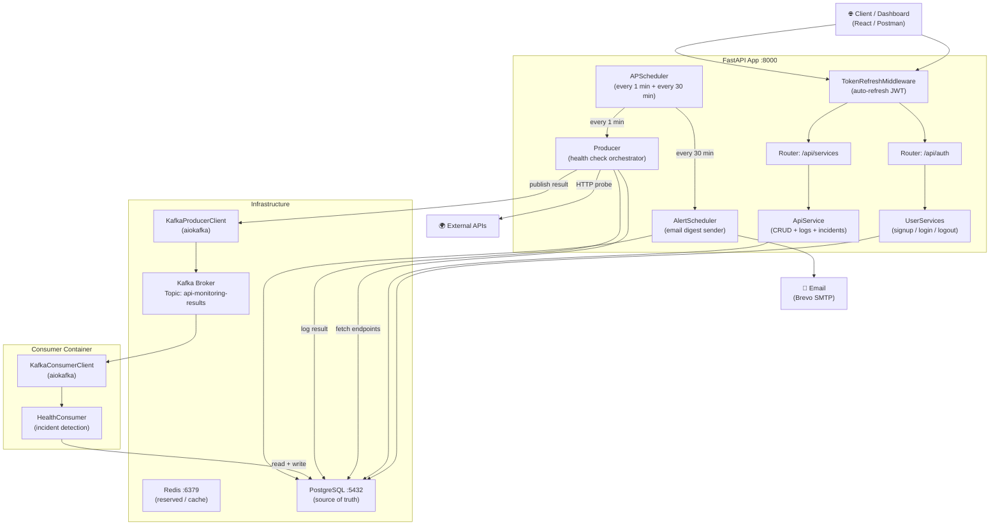
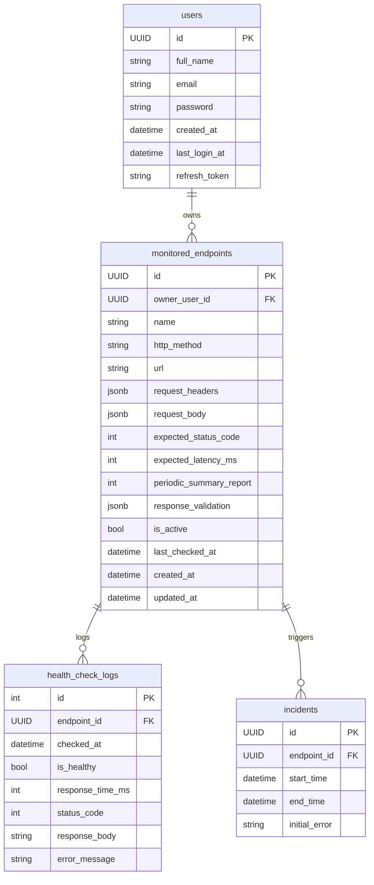
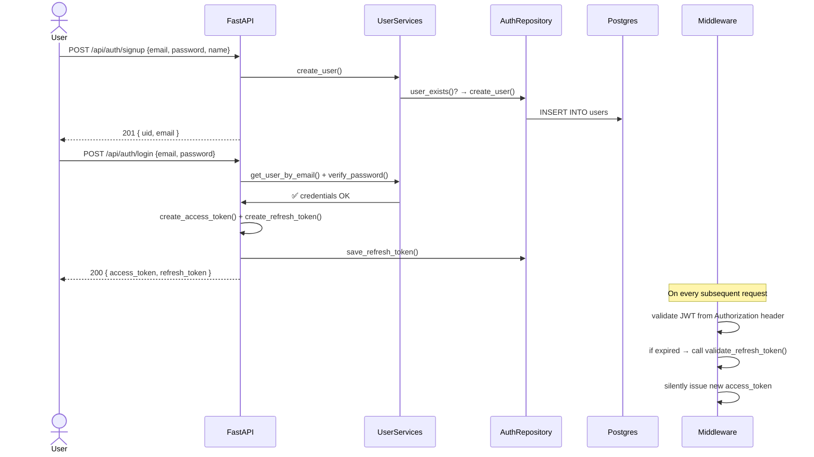
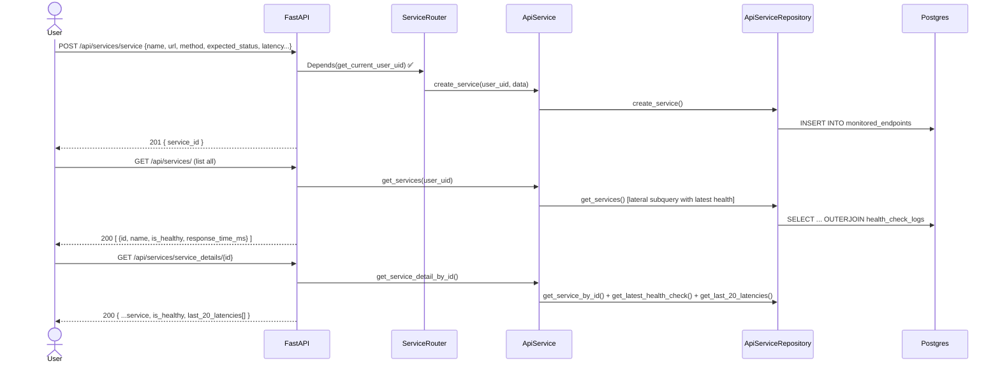
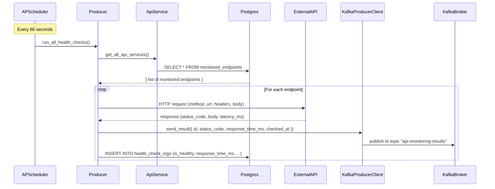
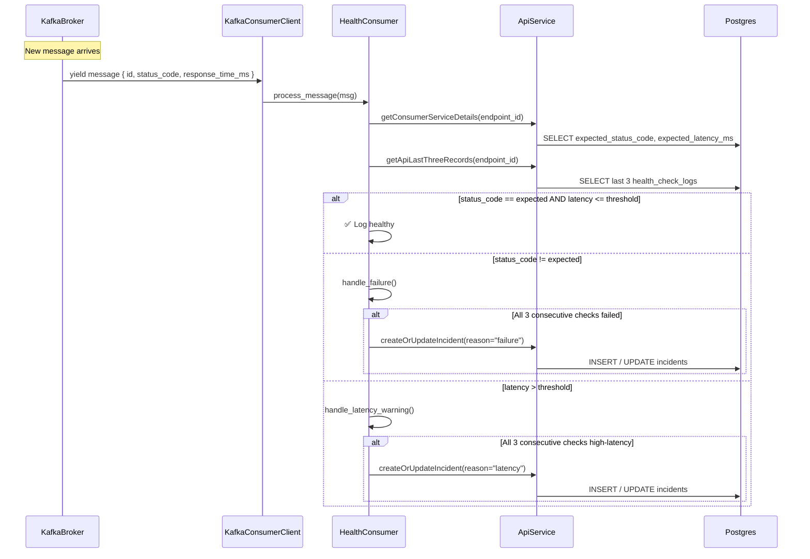
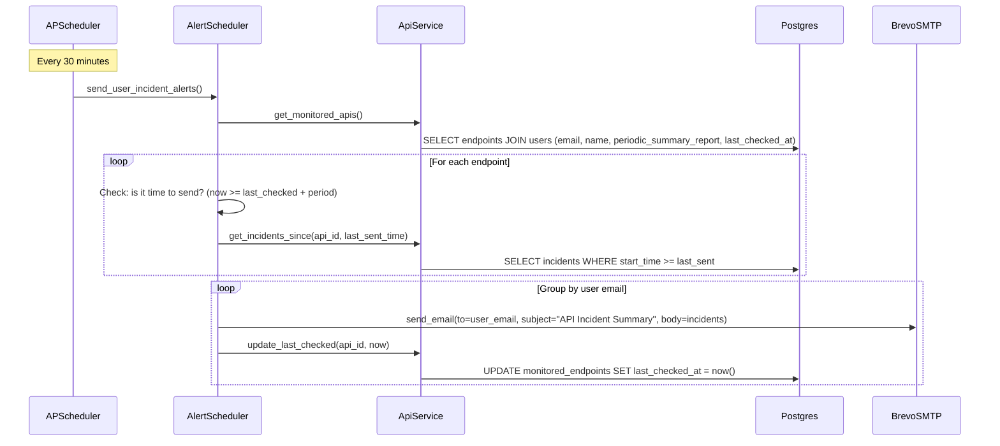
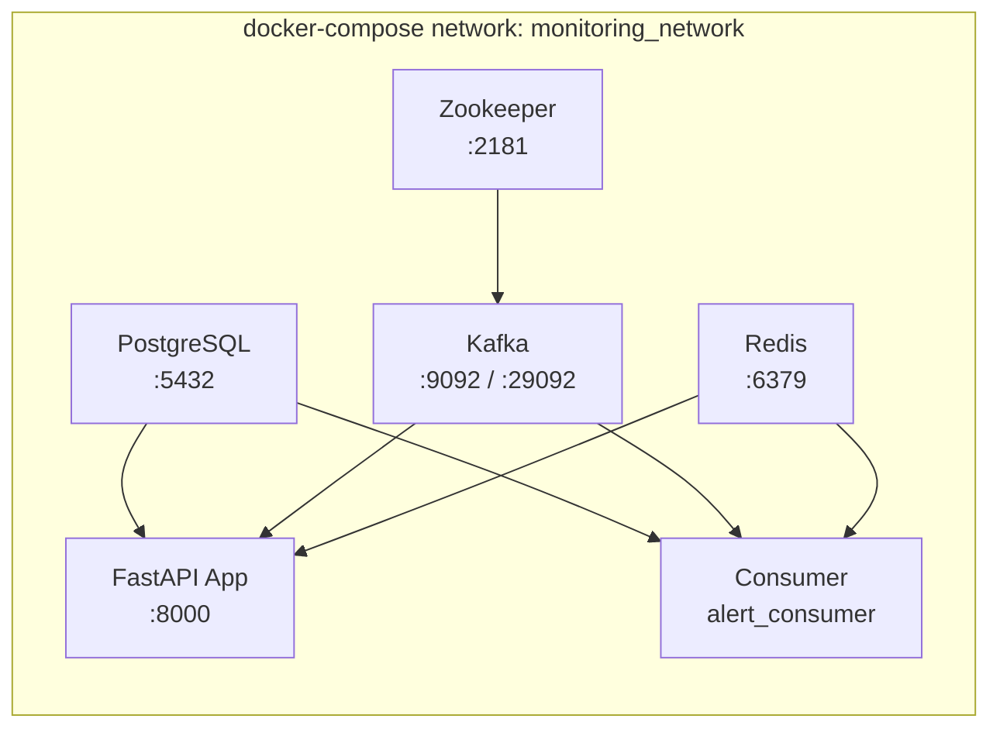

# Internal API Monitoring System — Architecture & Flow Guide

## What Is This Project?

**InternalApiMonitoringSystem** is a **backend-as-a-service platform** that continuously monitors the health and performance of third-party or internal HTTP APIs registered by users. Think of it as a personal **UptimeRobot / Statuspage** you self-host.

Every registered API endpoint is probed **every 60 seconds**. Results are streamed through **Apache Kafka**, processed by a dedicated consumer, incidents are detected and stored, and users receive **email digests** at their chosen cadence — all without any manual action after initial setup.

---

## Who Can Use It?

| Audience | Why They Would Use It |
|---|---|
| **Backend / DevOps engineers** | Monitor micro-services, REST APIs, or third-party webhooks and get alerted when things go down |
| **Platform / SRE teams** | Track SLA compliance with latency thresholds and response-code expectations |
| **Startup teams** | Lightweight self-hosted alternative to expensive APM tools |
| **API product owners** | Understand real-world uptime and latency trends of their APIs |
| **QA / test engineers** | Detect regressions in staging API environments automatically |

---

## High-Level Architecture



---

## System Components

### 1. FastAPI Application (`monitoring_api` container, port 8000)

| Layer | File(s) | Responsibility |
|---|---|---|
| **Routers** | [routers/auth.py](app/routers/auth.py), [routers/service.py](app/routers/service.py) | HTTP endpoints, request validation, response shaping |
| **Middleware** | `middlewares/token_refresh.py` | Silently refreshes expired JWTs on every request |
| **Services** | [services/auth.py](app/services/auth.py), [services/service.py](app/services/service.py) | Business logic; orchestrate repository calls |
| **Repositories** | `repositories/auth_repository.py`, [repositories/service_repository.py](app/repositories/service_repository.py) | All DB access via SQLModel / SQLAlchemy ORM |
| **Scheduler** | [main.py](app/main.py) → `APScheduler` | Fires two background jobs on startup |
| **Monitoring Engine** | [services/monitoring.py](app/services/monitoring.py) ([Producer](app/services/monitoring.py#L13-L104)) | Fetches all endpoints, calls them concurrently, publishes to Kafka, writes logs to DB |
| **Alert Engine** | [services/alert_scheduler.py](app/services/alert_scheduler.py) | Groups incidents per user and sends email digests |
| **Infrastructure clients** | `infrastructure/kafka/producer.py`, `infrastructure/clients/api_client.py` | Low-level Kafka publish and HTTP probe logic |

### 2. Kafka Consumer (`alert_consumer` container)

| File | Responsibility |
|---|---|
| [services/healthConsumer.py](app/services/healthConsumer.py) | Entry point; for each Kafka message, runs incident-detection logic |
| [infrastructure/kafka/consumer.py](app/infrastructure/kafka/consumer.py) | Low-level `AIOKafkaConsumer` wrapper; async generator of raw messages |

### 3. Supporting Infrastructure

| Service | Image | Role |
|---|---|---|
| **PostgreSQL** | `postgres:16` | Primary persistent store (users, endpoints, logs, incidents) |
| **Redis** | `redis:7-alpine` | Available for caching / rate-limiting (wired but extensible) |
| **Kafka** | `confluentinc/cp-kafka:7.4.0` | Async event bus between producer and consumer |
| **Zookeeper** | `confluentinc/cp-zookeeper:7.4.0` | Kafka cluster coordination |

---

## Database Schema



---

## Database Migrations

Schema is managed by **Alembic** — the app does not create tables on startup (`db.init_db()` only builds the async engine and session factory). Migrations live in [alembic/versions/](alembic/versions/).

[alembic/env.py](alembic/env.py) builds the connection URL from the `PG*` environment variables at runtime, so the placeholder `sqlalchemy.url` in `alembic.ini` is ignored. Run from the repository root:

```bash
alembic upgrade head                                    # apply all pending migrations
alembic current                                         # show the applied revision
alembic history                                         # list revisions
alembic revision --autogenerate -m "describe change"    # after editing db/models.py
alembic downgrade -1                                    # roll back one revision
```

Against the Docker stack (this is exactly what CI runs):

```bash
docker compose exec -T fastapi sh -c "cd /app && alembic upgrade head"
```

Committed revisions:

| Revision | Purpose |
|---|---|
| `f000a9dda83a` | Initial schema — enables the `uuid-ossp` extension, then creates `users`, `monitored_endpoints`, `health_check_logs`, `incidents` |
| `2862dbb9d305` | Rewrites the three foreign keys with `ON DELETE CASCADE` |

After the cascade revision, deletes propagate down the ownership chain: removing a user drops their endpoints, and removing an endpoint drops its health-check logs and incidents. No application-level cleanup is needed.

---

## Project Structure

```text
app/
├── main.py                          # FastAPI app, CORS, middleware, APScheduler lifespan
├── core/
│   ├── config.py                    # Pydantic Settings — all env vars land here
│   ├── security.py                  # JWT create/verify, password hashing, get_current_user_uid
│   └── exceptions.py
├── db/models.py                     # SQLModel tables (FKs cascade on delete)
├── routers/{auth,service}.py        # /api/auth, /api/services
├── services/
│   ├── auth.py                      # UserServices — signup/login/logout logic
│   ├── service.py                   # ApiService — endpoint CRUD, logs, incidents
│   ├── monitoring.py                # Producer — probes endpoints, logs, publishes to Kafka
│   ├── healthConsumer.py            # Consumer entry point — incident detection
│   └── alert_scheduler.py           # Groups incidents per user, sends digests
├── repositories/                    # All DB queries
├── infrastructure/
│   ├── kafka/{producer,consumer}.py # aiokafka clients
│   ├── clients/api_client.py        # HTTP probe logic
│   └── redis/{client,cache}.py
├── middlewares/token_refresh.py     # Auto-refresh expired JWTs
├── utils/{connect,mail,loggers,retry}.py
└── docker/{Dockerfile,Dockerfile.consumer}

alembic/
├── env.py                           # Builds the DB URL from PG* env vars at runtime
└── versions/                        # Migration revisions

tests/                               # Integration suite — conftest + test_auth + test_service
.github/workflows/test-project.yml   # CI: boot stack → migrate → wait for health → pytest
docker-compose.yml                   # Local stack
docker-compose-aws.yml               # Same, with Kafka JVM heap capped for small instances
```

---

## Flow Diagrams

### Flow 1 — User Registration & Login



---

### Flow 2 — Registering & Managing a Monitored API



---

### Flow 3 — Automated Health Check Pipeline (Core Loop)



---

### Flow 4 — Kafka Consumer & Incident Detection



---

### Flow 5 — Periodic Alert Email Digest



---

## REST API Reference

### Auth Endpoints (`/api/auth`)

| Method | Path | Auth | Description |
|---|---|---|---|
| `POST` | `/signup` | ❌ | Create a new user account |
| `POST` | `/login` | ❌ | Authenticate, receive access + refresh tokens |
| `GET` | `/logout` | ✅ JWT | Invalidate refresh token |
| `POST` | `/refresh` | ❌ | Exchange refresh token for a new access token |

### Service Endpoints (`/api/services`)

| Method | Path | Auth | Description |
|---|---|---|---|
| `GET` | `/health` | ❌ | System liveness check |
| `GET` | `/` | ✅ JWT | List all monitored endpoints for the logged-in user |
| `POST` | `/service` | ✅ JWT | Register a new API endpoint to monitor |
| `GET` | `/service/{id}` | ✅ JWT | Get raw config of one endpoint |
| `GET` | `/service_details/{id}` | ✅ JWT | Get config + latest health + last 20 latency data points |
| `PUT` | `/service/{id}` | ✅ JWT | Update endpoint configuration |
| `DELETE` | `/service/{id}` | ✅ JWT | Remove an endpoint from monitoring |
| `GET` | `/service/{id}/logs` | ✅ JWT | Full health check log history |
| `GET` | `/service/{id}/incident-logs` | ✅ JWT | All detected incidents for an endpoint |

---

## Incident Detection Logic

An incident is only raised after **3 consecutive failures** — never on a single bad check. This prevents noisy alerts from transient network blips.

```
┌──────────────────────────────────────────────────────────────┐
│ Consumer receives Kafka result for endpoint X                │
│                                                               │
│  ┌── status_code != expected_status_code ──────────────────┐ │
│  │  Fetch last 3 logs                                       │ │
│  │  All 3 is_healthy == False?  →  CREATE/UPDATE INCIDENT   │ │
│  └──────────────────────────────────────────────────────────┘ │
│                                                               │
│  ┌── latency > expected_latency_ms ────────────────────────┐ │
│  │  Fetch last 3 logs                                       │ │
│  │  All 3 latency > threshold?  →  CREATE/UPDATE INCIDENT   │ │
│  └──────────────────────────────────────────────────────────┘ │
│                                                               │
│  Incident merging: if same error type and time overlaps,     │
│  extend existing incident's end_time instead of creating new │
└──────────────────────────────────────────────────────────────┘
```

---

## Deployment Topology



All services share the `monitoring_network` bridge. The FastAPI app and consumer are built from separate Dockerfiles to keep concerns isolated.

`docker-compose-aws.yml` is identical to the local compose file except that Kafka's JVM heap is capped (`KAFKA_HEAP_OPTS: -Xmx256m -Xms128m`) so the stack fits on a 1 GB instance such as a `t2.micro`.

Before exposing this publicly:

- Set a strong, unique `SECRET_KEY` — it silently falls back to `"change-this-secret"`.
- Add the frontend origin to the `origins` list in [main.py](app/main.py) — CORS is an explicit allowlist.
- Drop the host port mappings for Postgres, Redis, and Kafka, or firewall them; only 8000 needs to be reachable.
- Remove `--reload` from the API Dockerfile `CMD` and the source bind-mount from the compose file.

---

## Configuration Reference

All settings are loaded by [core/config.py](app/core/config.py) from `.env` (gitignored).

| Group | Keys | Notes |
|---|---|---|
| **Postgres** | `PGHOST` `PGPORT` `PGDATABASE` `PGUSER` `PGPASSWORD` | The engine is only built when **all five** are present; otherwise every request fails with `pg_session_factory is not initialized` |
| **Redis** | `REDIS_HOST` `REDIS_PORT` `REDIS_USER` `REDIS_PASSWORD` | Wired but not yet on the critical path |
| **Kafka** | `KAFKA_BROKER_URL` `KAFKA_TOPIC_NAME` `KAFKA_ACKS` `KAFKA_COMPRESSION_TYPE` `KAFKA_ENABLE_IDEMPOTENCE` `KAFKA_MAX_RETRIES` `KAFKA_RETRY_DELAY_S` | The producer and consumer read **`KAFKA_BROKER_URL`**, *not* `KAFKA_BROKER` — the latter exists in config but is unused |
| **JWT** | `SECRET_KEY` `JWT_ALGORITHM` `ACCESS_TOKEN_EXPIRY` (s) `REFRESH_TOKEN_EXPIRY` (days) | Defaults to an insecure placeholder secret if unset |
| **Email** | `BREVO_SMTP_SERVER` `BREVO_SMTP_PORT` `BREVO_SMTP_USERNAME` `BREVO_SMTP_PASSWORD` `SENDER_EMAIL` | Missing values don't crash anything — `send_email` catches and logs failures |
| **Tests** | `API_BASE_URL` | Target for the integration suite; defaults to `http://localhost:8000` |

`docker-compose.yml` interpolates only `PGDATABASE`, `PGUSER`, and `PGPASSWORD` from `.env`. Container-side hosts are set inline: `PGHOST=postgres`, `REDIS_HOST=redis`, `KAFKA_BROKER_URL=kafka:29092`.

---

## Testing

The suite in [tests/](tests) is **black-box integration testing** — nothing is mocked. A synchronous `httpx.Client` fixture points at `API_BASE_URL` (default `http://localhost:8000`), so the full stack must be up and migrated before `pytest` runs.

| File | Coverage |
|---|---|
| [tests/conftest.py](tests/conftest.py) | Fixtures: `api_client`, `test_user` (unique email per module), `auth_token`, `auth_headers`, `service_id` |
| [tests/test_auth.py](tests/test_auth.py) | `AUTH_001`–`AUTH_008` — signup (valid / duplicate / invalid email), login (valid / bad password), refresh (valid / invalid), logout |
| [tests/test_service.py](tests/test_service.py) | `SERVICE_001`–`SERVICE_013` — create, auth failures, missing fields, read, update, list, details, logs, incident logs, delete |

Notes:

- Tests write to whatever database the stack is pointed at and **do not clean up** — every module signs up a fresh `test_<uuid>@gmail.com` user. Never run against production.
- `pytest` is **not** in `requirements.txt`; CI installs it separately inside the container.
- Fixtures are module-scoped, so `test_service.py` reuses one user and one service across its cases; ordering within that file matters (`SERVICE_012` deletes the service that `SERVICE_013` then expects to be gone).

### CI Pipeline

[.github/workflows/test-project.yml](.github/workflows/test-project.yml) runs on push and PR to `main` and `staging` (skipping `**.md`-only changes):

1. Write `.env` from repository secrets
2. `docker compose -f docker-compose-aws.yml up -d --build`
3. `alembic upgrade head` inside the `fastapi` container
4. Poll `/api/services/health` with retries until the API answers
5. `pip install pytest`, then `pytest tests/ -v -s` inside the container
6. Dump `fastapi` and `consumer` logs on failure; `docker compose down -v` always

---

## Troubleshooting

| Symptom | Cause / fix |
|---|---|
| `relation "users" does not exist` | Migrations never applied — run `alembic upgrade head` |
| `alembic: command not found` / wrong revision | Run from the repo root (`script_location = alembic`), with the `PG*` vars exported — `env.py` reads them directly |
| `pg_session_factory is not initialized` | One of the five `PG*` vars is missing |
| `Failed to initialize Kafka producer` in API logs | Kafka unreachable. The app starts anyway by design — checks are still logged, but nothing reaches the consumer. Use `kafka:29092` inside Docker, `localhost:9092` from the host |
| Health logs appear but no incidents | The consumer isn't running — start `alert_consumer`, or `python -m app.services.healthConsumer` locally |
| No emails | Brevo vars unset or wrong; the mailer logs `Email send failed` instead of raising |
| Browser requests blocked by CORS | Add the origin to `origins` in `main.py` |
| Nothing happens for the first minute | Expected — the scheduler runs on a 1-minute interval and doesn't fire immediately on startup |
| Tests fail with connection refused | The suite needs a live API — start the stack and check `API_BASE_URL` |

---

## Key Design Decisions

| Decision | Rationale |
|---|---|
| **Kafka as result bus** | Decouples health-check execution from incident analysis; consumer can be scaled independently |
| **Separate consumer container** | Consumer is long-running; isolating it prevents it from blocking the HTTP API process |
| **APScheduler inside FastAPI** | Avoids a third process (Celery) for lightweight scheduling; starts/stops cleanly with FastAPI lifespan |
| **Repository pattern** | Clean separation between business logic and database queries; easy to unit test |
| **Consecutive-3 rule for incidents** | Reduces alert noise; single dropped packets won't create false incidents |
| **Refresh token in DB** | Enables server-side logout and token revocation, unlike pure stateless JWT |
| **`TokenRefreshMiddleware`** | Transparent token refresh for frontend — clients don't need to handle 401 + refresh themselves |
