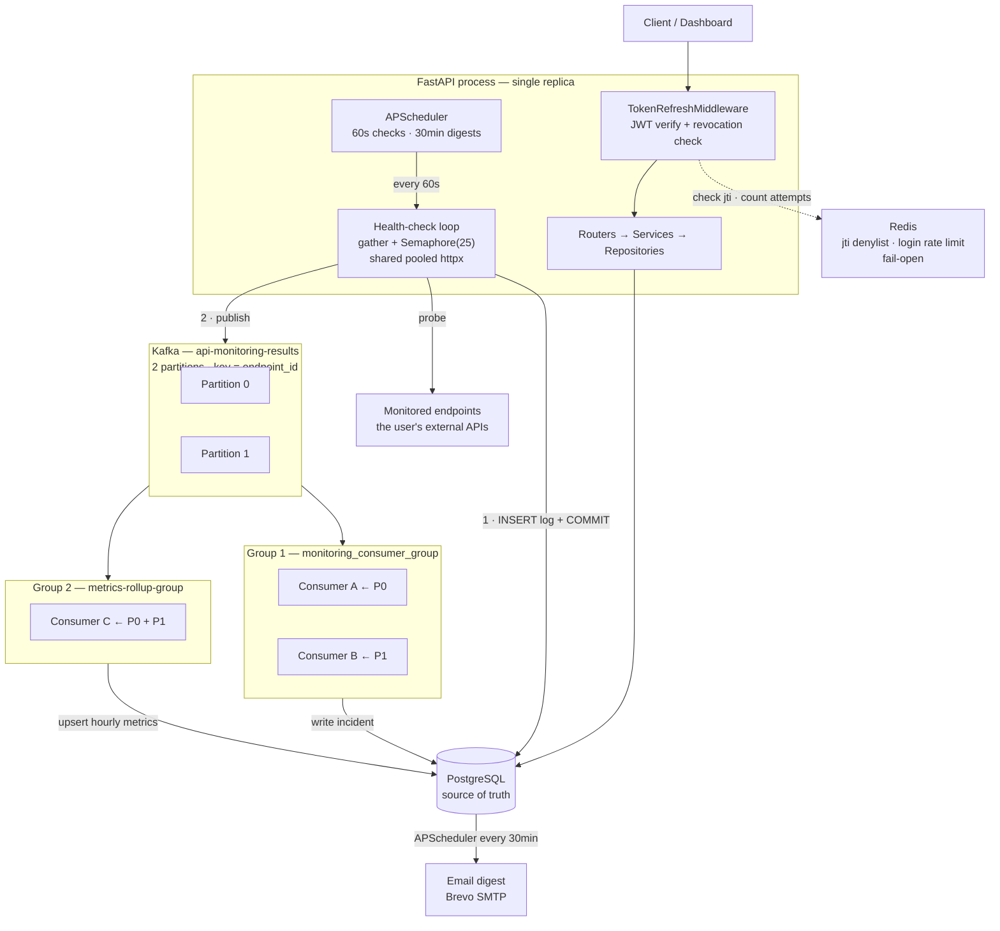
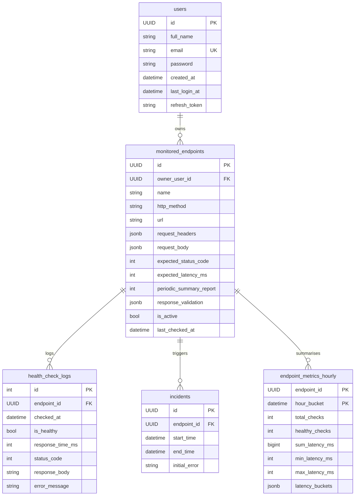
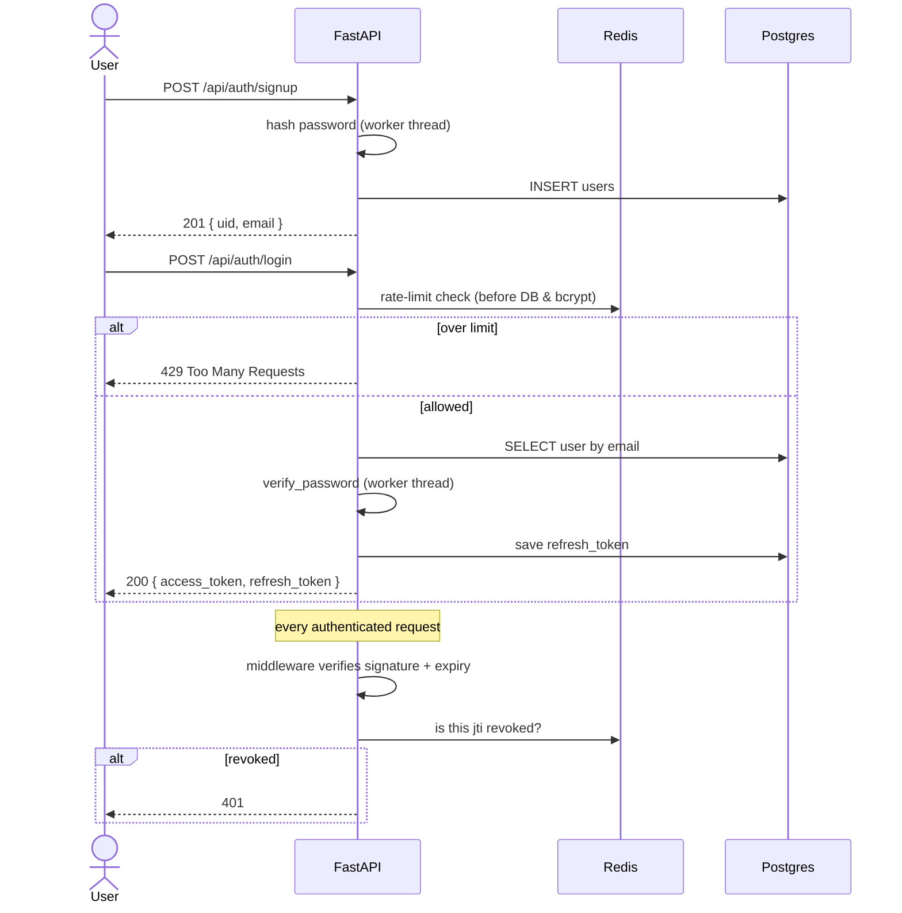
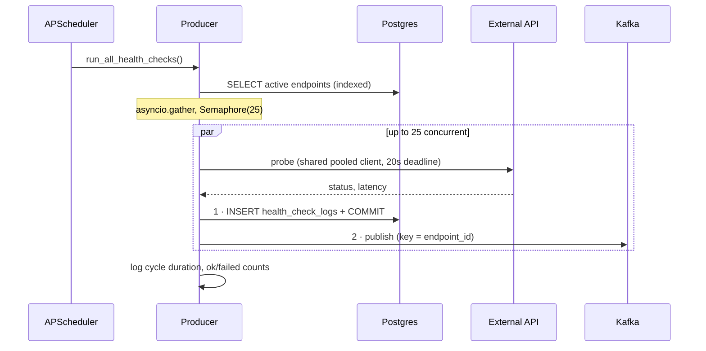
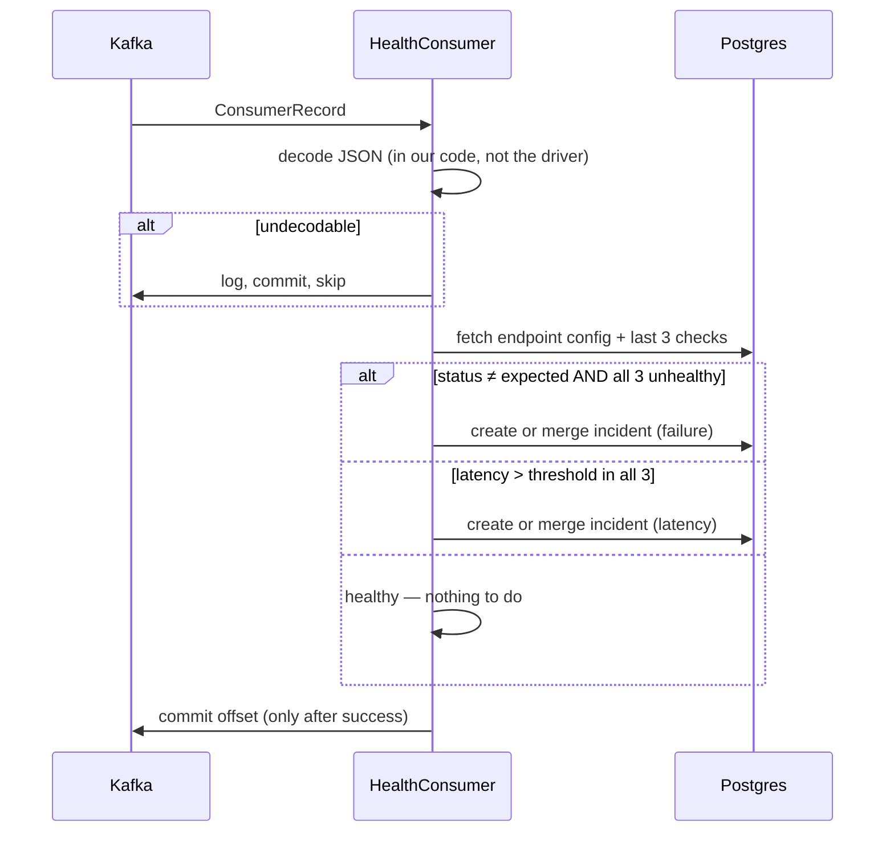
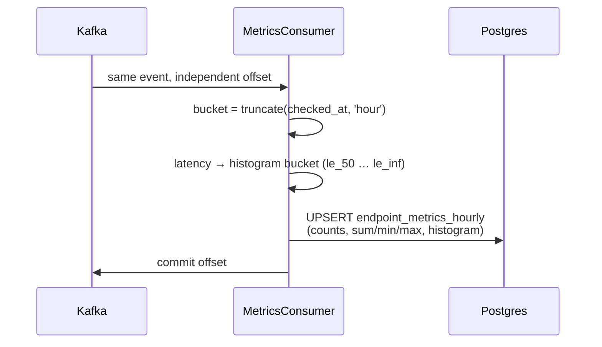
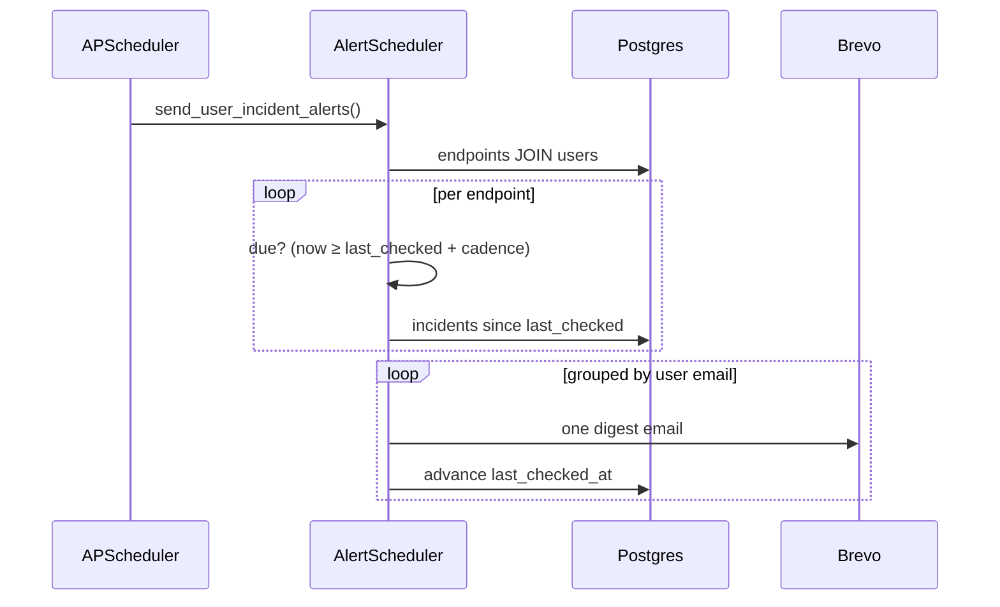

# Architecture & Engineering Guide

Complete reference for the Internal API Monitoring System — how it works, why it is built this way, and what must not be broken. For installation and day-to-day commands see [README.md](../README.md).

Users register HTTP endpoints. Every 60 seconds each one is probed, the result is written to PostgreSQL and published to Kafka, two independent consumer groups turn that stream into **incidents** and **hourly uptime metrics**, and a scheduled job emails per-user digests.

**Stack:** FastAPI · PostgreSQL 16 · Apache Kafka · Redis 7 · APScheduler · SQLModel/SQLAlchemy (async) · Docker Compose

---

## Table of Contents

- [Architecture](#architecture)
- [Processes](#processes)
- [Folder Structure](#folder-structure)
- [Data Model](#data-model)
- [Kafka Topology](#kafka-topology)
- [Core Flows](#core-flows)
- [Redis](#redis)
- [API Reference](#api-reference)
- [Configuration](#configuration)
- [Database Migrations](#database-migrations)
- [Testing](#testing)
- [Invariants — Do Not Break](#invariants--do-not-break)
- [What Was Fixed](#what-was-fixed)
- [Known Issues](#known-issues)
- [Troubleshooting](#troubleshooting)
- [Design Decisions](#design-decisions)

---

## Architecture



Three rules this encodes:

1. **The database write happens before the Kafka publish.** The consumer reads recent checks from Postgres, so publishing first could let it read a window missing the very check it is reacting to. Writing first means a failed publish delays detection by one cycle rather than producing a *wrong* verdict.
2. **Both groups read every message**, with independent offsets. If the rollup lags or dies, alerting is unaffected. That isolation is the entire reason a second group exists rather than a second function call.
3. **Keying by `endpoint_id`** pins every check for an endpoint to one partition — which is what makes two detector consumers safe on the "last 3 checks" rule.

An annotated visual version lives at [docs/architecture-diagram.html](architecture-diagram.html) (open in a browser).

---

## Processes

| Container | Entry point | Replicas | Responsibility |
|---|---|---|---|
| `monitoring_api` | [app/main.py](../app/main.py) | **1 only** | REST API + both APScheduler jobs |
| `consumer` | [app/services/healthConsumer.py](../app/services/healthConsumer.py) | 2 | Kafka → incident detection |
| `metrics_consumer` | [app/services/metricsConsumer.py](../app/services/metricsConsumer.py) | 1 | Kafka → hourly uptime/latency rollup |
| `postgres` / `kafka` / `redis` | — | 1 each | Storage, event bus, ephemeral security state |

**The API cannot be replicated.** Each replica would run its own scheduler → duplicate probes and duplicate log rows, which corrupts the "last 3 records" rule and turns a single blip into an incident. Scale the consumers instead.

### Layering

```
routers → services → repositories → SQLModel/SQLAlchemy → PostgreSQL
```

- Repositories **never open their own session**. The router builds it via `Depends(get_db_session)` and threads it down. Background jobs use `async with db.pg_session_factory() as session:`.
- Repository methods return `dict(row)`, **not** ORM objects. Use `row["field"]`, never `row.field` — several bugs came from getting this wrong.
- Tenant scoping is enforced **in the SQL predicate** (`owner_user_id == self.user_uid`), never in Python.

---

## Folder Structure

```text
app/
├── main.py                          FastAPI app, CORS, middleware, APScheduler lifespan
├── core/
│   ├── config.py                    Pydantic Settings — every env var lands here
│   ├── security.py                  JWT create/verify, password hashing, current-user dep
│   └── exceptions.py                (empty — reserved)
├── db/models.py                     SQLModel tables; FKs cascade on delete
├── routers/
│   ├── auth.py                      /api/auth  — signup, login, logout, refresh
│   └── service.py                   /api/services — CRUD, logs, incidents, health, readyz
├── services/
│   ├── auth.py                      UserServices — signup/login/refresh logic
│   ├── service.py                   ApiService — endpoint CRUD, logs, incidents
│   ├── monitoring.py                Producer — concurrent probe loop
│   ├── healthConsumer.py            Consumer group 1 — incident detection
│   ├── metricsConsumer.py           Consumer group 2 — hourly rollup
│   └── alert_scheduler.py           Groups incidents per user, sends digests
├── repositories/
│   ├── auth_repository.py           User + refresh-token queries
│   ├── service_repository.py        Endpoint, log, incident queries
│   └── metrics_repository.py        Hourly rollup upserts + reconciliation
├── infrastructure/
│   ├── kafka/producer.py            AIOKafkaProducer wrapper, reconnect + lock
│   ├── kafka/consumer.py            AIOKafkaConsumer wrapper, manual commits
│   ├── clients/api_client.py        HTTP probe + shared pooled client
│   └── redis/{client,cache}.py      Fail-open wrapper + denylist/rate-limit
├── middlewares/token_refresh.py     JWT validation + revocation check
├── utils/{connect,mail,loggers}.py  DB/Redis engines, SMTP, logging
└── docker/{Dockerfile,Dockerfile.consumer}

alembic/versions/                    Migrations (schema is NOT auto-created)
tests/                               Black-box HTTP integration suite
docs/architecture-diagram.html       Annotated architecture visual
docker-compose.yml                   Local stack
docker-compose-aws.yml               Same, Kafka JVM heap capped for small instances
```

---

## Data Model



| Table | Notes |
|---|---|
| `users` | One refresh token per user, so a second login invalidates the first device |
| `monitored_endpoints` | `periodic_summary_report` is the digest cadence in minutes |
| `health_check_logs` | **Fastest-growing table** — 1 row/endpoint/minute ≈ 720k rows/day at 500 endpoints |
| `incidents` | Opened only after 3 consecutive failures; overlapping same-type incidents are merged |
| `endpoint_metrics_hourly` | Pre-aggregated so "30-day uptime" doesn't scan ~21M rows per dashboard load |

**Indexes** (all added in migration `a1b2c3d4e5f6`; Postgres does *not* auto-index foreign keys):

- `health_check_logs (endpoint_id, checked_at)`
- `incidents (endpoint_id, start_time)`
- `monitored_endpoints (owner_user_id)`

All three foreign keys cascade on delete: removing a user drops their endpoints, and removing an endpoint drops its logs, incidents, and metrics.

---

## Kafka Topology

```
              PRODUCER  (health-check loop, every 60s)
                        key = endpoint_id
                              │
                              ▼
    ╔═══════════════════════════════════════════════╗
    ║  TOPIC: api-monitoring-results                ║
    ║  2 partitions                                 ║
    ║   ┌────────┐   ┌────────┐                    ║
    ║   │   P0   │   │   P1   │                    ║
    ║   └────────┘   └────────┘                    ║
    ╚═══════════════════════════════════════════════╝
           │              │
           ▼              ▼
 ┌──────────────────────────────┐   ┌────────────────────────────┐
 │ GROUP 1                      │   │ GROUP 2                    │
 │ monitoring_consumer_group    │   │ metrics-rollup-group       │
 │                              │   │                            │
 │  Consumer A ── P0            │   │  Consumer C ── P0, P1      │
 │  Consumer B ── P1            │   │                            │
 │  → incidents table           │   │  → endpoint_metrics_hourly │
 └──────────────────────────────┘   └────────────────────────────┘
```

**1 topic · 2 partitions · 2 consumer groups · 3 consumer processes**

- **Every group reads every message.** Separate offsets, separate lag.
- **Within a group, partitions divide.** Two consumers take one partition each; a third would sit idle — a partition is only ever assigned to one consumer per group.
- **Consumer group ≠ retention.** The group tracks *offsets* (where to resume); the topic's retention setting controls how far back you *can* resume.

### The event

Messages are **self-describing** — they carry the judgment inputs, not just the facts, so the consumer needs no config lookup and a replay reproduces the same verdict even if the endpoint was edited since:

```json
{
  "event_version": 1,
  "id": "…", "name": "Payments API",
  "checked_at": "2026-08-15T…",
  "status_code": 500, "response_time_ms": 1240,
  "expected_status_code": 200, "expected_latency_ms": 500,
  "is_healthy": false, "error_message": null
}
```

### Delivery semantics

`enable_auto_commit=False`; offsets are committed **only after successful processing** → at-least-once. Safe here because incident detection recomputes from the database window, so reprocessing produces an identical result.

---

## Core Flows

### Auth



### Health-check cycle (every 60s)



Failure isolation is layered: each probe has its own `try/except`, `gather(return_exceptions=True)` stops one failure cancelling siblings, and a 20-second deadline caps any single endpoint. One dead endpoint cannot slow or break the cycle.

### Incident detection (Group 1)



An incident opens only after **3 consecutive** failures, so a single dropped packet never pages anyone. If an open incident of the same type overlaps in time, its `end_time` is extended instead of inserting a duplicate.

### Metrics rollup (Group 2)



Percentiles come from fixed histogram buckets (the Prometheus approach): bounded storage, exact uptime, approximate p50/p95/p99.

### Email digest (every 30 min)



---

## Redis

Redis is **optional** — every call is wrapped by `redis_call()` and returns a fail-open default. Stopping the container degrades features; it never breaks a request.

| Feature | Key | Structure / TTL |
|---|---|---|
| Logout revocation | `auth:jti:denied:{jti}` | String, TTL = token's remaining life |
| Login rate limit (IP) | `rl:login:ip:{ip}` | `INCR` + `EXPIRE NX`, 30 per 5 min |
| Login rate limit (email) | `rl:login:email:{email}` | `INCR` + `EXPIRE NX`, 5 per 15 min |

**Postgres is the source of truth.** Redis holds only ephemeral security state — a `FLUSHALL` resets some rate-limit windows and un-revokes some already-logged-out tokens for the remainder of their short life. No monitoring data is affected.

Fixed-window counters, not sorted sets: a ZSET stores one member per attempt, so memory would grow with attack volume — backwards for a brute-force defence.

---

## API Reference

Base URL `http://localhost:8000`. Authenticated routes take `Authorization: Bearer <access_token>`.

### `/api/auth`

| Method | Path | Auth | Description |
|---|---|---|---|
| POST | `/signup` | — | Create an account |
| POST | `/login` | — | Authenticate; returns access + refresh tokens (rate limited) |
| GET | `/logout` | JWT | Revokes the refresh token **and** the presented access token |
| POST | `/refresh` | — | Exchange a refresh token for a new access token |

### `/api/services`

| Method | Path | Auth | Description |
|---|---|---|---|
| GET | `/health` | — | Liveness — always 200 while the process serves |
| GET | `/readyz` | — | Readiness — checks Postgres, Redis, Kafka; 503 if Postgres is down |
| GET | `/` | JWT | List the caller's endpoints with latest health |
| POST | `/service` | JWT | Register an endpoint |
| GET | `/service/{id}` | JWT | Raw configuration |
| GET | `/service_details/{id}` | JWT | Config + latest health + last 20 latencies |
| PUT | `/service/{id}` | JWT | Update configuration |
| DELETE | `/service/{id}` | JWT | Remove from monitoring |
| GET | `/service/{id}/logs` | JWT | Health-check history (last 30) |
| GET | `/service/{id}/incident-logs` | JWT | Detected incidents |

Every response uses the same envelope:

```json
{ "success": true, "message": "...", "data": { } }
```

---

## Configuration

All settings load from `.env` via [app/core/config.py](../app/core/config.py). `.env` is gitignored — never commit real credentials.

```env
# PostgreSQL
PGHOST=localhost
PGPORT=5432
PGDATABASE=api_monitoring
PGUSER=postgres
PGPASSWORD=your_password

# Redis
REDIS_HOST=localhost
REDIS_PORT=6379

# Kafka
KAFKA_BROKER_URL=localhost:9092
KAFKA_TOPIC_NAME=api-monitoring-results
KAFKA_CONSUMER_GROUP=monitoring_consumer_group
KAFKA_ROLLUP_GROUP=metrics-rollup-group
KAFKA_AUTO_OFFSET_RESET=latest

# JWT  — SECRET_KEY has NO default; the app refuses to start without it
SECRET_KEY=replace-with-a-long-random-string
ACCESS_TOKEN_EXPIRY=3600      # seconds
REFRESH_TOKEN_EXPIRY=86400    # SECONDS, not days

# Health checks
HEALTH_CHECK_CONCURRENCY=25
HEALTH_CHECK_TIMEOUT_S=20

# Email (Brevo SMTP)
BREVO_SMTP_SERVER=smtp-relay.brevo.com
BREVO_SMTP_PORT=587
BREVO_SMTP_USERNAME=your_login
BREVO_SMTP_PASSWORD=your_smtp_key
SENDER_EMAIL=alerts@yourdomain.com

API_BASE_URL=http://localhost:8000   # test suite target
```

Notes:

- The Kafka clients read **`KAFKA_BROKER_URL`**, not `KAFKA_BROKER` (which exists in config but is dead).
- `docker-compose.yml` interpolates only `PGDATABASE`, `PGUSER`, `PGPASSWORD` from `.env`; container hosts are set inline (`PGHOST=postgres`, `KAFKA_BROKER_URL=kafka:29092`).
- `KAFKA_AUTO_OFFSET_RESET` defaults to `latest` deliberately — with `earliest`, a consumer starting fresh replays the entire backlog against *current* windows and manufactures bogus historical incidents.

---

## Database Migrations

Schema is Alembic-managed; **the app does not create tables at startup**. [alembic/env.py](../alembic/env.py) builds the URL from the `PG*` env vars at runtime, so the placeholder in `alembic.ini` is ignored.

```bash
alembic upgrade head                                   # apply
alembic current                                        # show revision
alembic revision --autogenerate -m "describe change"   # after editing models
alembic downgrade -1                                   # roll back one

docker compose exec -T fastapi sh -c "cd /app && alembic upgrade head"
```

| Revision | Purpose |
|---|---|
| `f000a9dda83a` | Initial schema + `uuid-ossp` extension |
| `2862dbb9d305` | `ON DELETE CASCADE` on the three foreign keys |
| `a1b2c3d4e5f6` | Three indexes + `endpoint_metrics_hourly` |

---

## Testing

The suite in [tests/](../tests) is **black-box HTTP** against `API_BASE_URL` — it imports nothing from `app/`, so internal refactors are invisible to it. The full stack must be running and migrated.

```bash
pip install pytest          # not in requirements.txt
pytest tests/ -v -s
# or, the way CI does it:
docker compose exec -T fastapi sh -c "pip install pytest && pytest tests/ -v -s"
```

- `test_auth.py` — `AUTH_001`–`AUTH_008`: signup, login, refresh, logout
- `test_service.py` — `SERVICE_001`–`SERVICE_013`: CRUD, auth failures, logs, incidents

Tests create real rows and **never clean up** — point them at a throwaway database. Fixtures are module-scoped, so ordering matters inside `test_service.py`.

**CI** ([.github/workflows/test-project.yml](../.github/workflows/test-project.yml)) boots the stack, migrates, waits on `/health`, then runs the suite inside the container.

---

## Invariants — Do Not Break

- **Write to Postgres BEFORE publishing to Kafka.** Reordering turns a one-cycle delay into a wrong verdict.
- **`get_consumer_service` and `get_last_three_records` carry no `owner_user_id` filter** — they are system-context queries reachable only from consumers. Adding a tenant filter renders as `IS NULL` against a `NOT NULL` column and silently kills the pipeline.
- **Never set `value_deserializer` on the Kafka consumer.** Decoding must stay in our code; inside the driver a malformed payload cannot be caught or skipped, creating an unbreakable poison loop.
- **`keepalive_expiry` must stay below the 60s check interval.** A pooled socket the server already closed fails on reuse and httpx does not retry — which registers as a false *unhealthy* reading.
- **Keep bcrypt off the event loop** — wrap `verify_password` / `get_password_hash` in `run_in_threadpool`. It is ~250 ms of CPU on the loop APScheduler shares.
- **Every Redis call goes through `redis_call()`** and fails open.
- **Commit Kafka offsets only after successful processing.**
- **Single API replica.** Two schedulers double-probe and corrupt the 3-failure rule.

### Reviewed and correct — leave alone

- The **LATERAL join** in `get_services()` — the right idiom for latest-row-per-group
- `UPDATE/DELETE ... WHERE id = ? AND owner_user_id = ? RETURNING id` — race-free authorized writes, no read-then-write TOCTOU
- Ownership predicates on all seven user-facing service routes — no reachable IDOR
- Session injection via `Depends(get_db_session)`; no repository opens its own session
- bcrypt/passlib pinning (`passlib==1.7.4` + `bcrypt==4.0.1` — passlib breaks on bcrypt ≥ 4.1)
- Kafka keying by endpoint UUID, `acks=all`, `enable_idempotence=True`
- The multi-process split and the 3-consecutive-failures rule

---

## What Was Fixed

Two subsystems had **never worked**. Both failed silently — broad `except Exception` blocks logged and continued, so the system reported itself healthy while doing nothing.

### Previously dead

| Area | The bug |
|---|---|
| **Incident detection** | Consumer queries filtered `owner_user_id == self.user_uid`, but the consumer builds the repository without a user. SQLAlchemy renders `== None` as `IS NULL` against a `NOT NULL` column, so the query **always returned nothing**. |
| **Incident merging** | `get_last_incident()` returns a dict, but code used attribute access (`.end_time`) → `AttributeError` → rollback. Once an endpoint had one incident it could never get another. |
| **Email digests** | `db.get_session()` does not exist — only `get_db_session`. The job crashed on its first line every 30 minutes, forever. |
| **Consumer crashes** | `msg["id"]` sat outside the try block, so one malformed message killed the container. |
| **`update_last_checked`** | `func` was imported inside a *different* function → `NameError` on every call. |

### Performance & scale

- **Three indexes added.** There were none on the hot tables, so every read scanned `health_check_logs` end to end.
- **Probe loop is now concurrent** — was a plain `for` loop despite the docstring claiming otherwise; 500 endpoints could not finish inside 60s.
- **One shared pooled HTTP client** instead of a new client (and TLS handshake) per probe.
- **DB pool raised 15 → 30**, necessarily *before* enabling concurrency.
- **Scheduler grace period 1s → 30s** — the 1-second default silently skipped runs whenever the loop was briefly busy.
- **Response truncation fixed** — it flagged `_truncated` then stored the full body anyway.
- **`PoolTimeout` separated from endpoint timeouts**, so monitor saturation can't fabricate incidents for healthy services.

### Kafka

- Manual commits (was auto-commit on a timer → lost messages on crash)
- JSON decoding moved out of the driver (fixes an unrecoverable poison-message loop)
- Supervised reconnect with backoff (the loop used to end quietly and exit code 0)
- Producer reconnect behind a lock, plus a leak fix — **Kafka had been down for 2 months and every result was silently dropped**
- 1 → 2 partitions, a persistent volume, and the second consumer group

### Security

- **Refresh tokens never compared to the stored one** — any signed token for that user, including a plain access token or a months-old revoked one, minted new access tokens. Expiry was ignored too.
- **Expired access tokens were accepted** by the dependency every protected route uses.
- **bcrypt blocked the event loop** (~250 ms), starving the scheduler at ~4 logins/sec.
- **No login rate limiting** existed at all.
- **Logout left the access token valid** for up to an hour.
- **Hardcoded fallback `SECRET_KEY`** removed; the app now refuses to start without one.
- `REFRESH_TOKEN_EXPIRY` was documented in days but used as seconds — the default meant tokens expired after **1 second**.

### Verified live

Incident created after 3 failed checks · 2 partitions with 2 consumer groups · rollup writing · indexes in use · **21/21 existing tests pass** · app fully functional with Redis stopped.

---

## Known Issues

1. **Email digests still poll Postgres** on a 30-minute timer rather than consuming an incidents topic.
2. **`reconcile_hour()` is not scheduled.** Metric counters are not idempotent under at-least-once delivery, so a redelivered message double-counts. The drift on a percentage is tiny and this function corrects it — but nothing calls it yet.
3. **`response_validation`** is stored and selected but never evaluated anywhere.
4. **Mixed timezone handling** — `datetime.utcnow()` (naive) and `datetime.now(timezone.utc)` (aware) coexist; `alert_scheduler.py` normalises to compensate.
5. **No metrics/tracing export** — no Prometheus or OpenTelemetry.

---

## Troubleshooting

| Symptom | Cause / fix |
|---|---|
| `relation "users" does not exist` | Migrations not applied — `alembic upgrade head` |
| App refuses to start, complains about `SECRET_KEY` | Set a real value in `.env`; the placeholder is rejected by design |
| `pg_session_factory is not initialized` | One of the five `PG*` vars is missing — the engine is built only when all are present |
| Health logs appear but no incidents | Needs 3 *consecutive* failures; check `docker compose logs -f consumer` |
| `Failed to initialize Kafka producer` | Broker unreachable. The app starts anyway by design and now reconnects automatically. Use `kafka:29092` inside Docker, `localhost:9092` from the host |
| Second consumer idle | Topic has 1 partition. `KAFKA_NUM_PARTITIONS` only affects *new* topics — delete and let it recreate |
| Consumer replays old messages | `KAFKA_AUTO_OFFSET_RESET=earliest` on a fresh group. Use `latest`, or reset offsets |
| No emails | Brevo vars unset; the mailer logs `Email send failed` rather than raising |
| Login returns 429 | Rate limit (30/5min per IP). Tune `LOGIN_RATE_LIMIT_*` |
| CORS errors in the browser | Add the origin to `origins` in [app/main.py](../app/main.py) |
| Nothing happens for the first minute | Expected — the scheduler fires on an interval, not immediately at startup |

---

## Design Decisions

| Decision | Rationale |
|---|---|
| **Kafka as the result bus** | Decouples probing from analysis, and lets notification channels be added as independent consumers without touching the detection path |
| **Two consumer groups** | Same stream, two projections. The rollup can lag or die without affecting alerting |
| **2 partitions** | Not throughput (8 msg/s needs none) — it is what allows a second consumer to exist at all |
| **At-least-once + idempotent handler** | Duplicates are free because detection recomputes from the DB window; losses are not |
| **DB write before publish** | Converts a failed publish into a one-cycle delay rather than a wrong verdict |
| **APScheduler in-process** | Avoids a third runtime for two lightweight jobs; starts and stops with the FastAPI lifespan |
| **Repository pattern** | Clean separation of business logic from queries; ownership enforced in SQL |
| **3-consecutive-failures rule** | Single dropped packets don't create incidents |
| **Refresh token in DB** | Enables server-side revocation, unlike pure stateless JWT |

### Considered and rejected

| Rejected | Why |
|---|---|
| **RabbitMQ instead of Kafka** | Better fit for a pure work queue, but a multi-day lateral move with no user-visible benefit — and it models the two-independent-consumers pattern less naturally |
| **Schema Registry** | One producer, one consumer, same repo, same Pydantic class — the contract is a Python import, which is stronger. `event_version` + tolerant parsing covers compatibility |
| **Kafka Streams / ksqlDB** | A JVM runtime to do what ~40 lines of Python does at this volume |
| **Exactly-once semantics** | EOS is end-to-end *within Kafka*; the side effect here is a Postgres write, so an idempotent handler is still required — and already exists |
| **Transactional outbox** | Solves the commit-then-publish gap, which self-heals within one 60s cycle. A table plus a relay process to avoid a one-cycle delay |
| **Redis caching of dashboard reads** | The missing indexes were the actual problem. Caching would have papered over a one-line migration |
| **Last-3 window in Redis** | Would create a second source of truth for alerting; a restart would empty it and incidents would be missed |
| **Circuit breakers on probes** | Actively wrong for a monitor — it is *supposed* to keep probing a down endpoint. Backing off delays recovery detection |
| **Celery / separate worker fleet** | ~8 probes/second fits in one event loop with room to spare |
